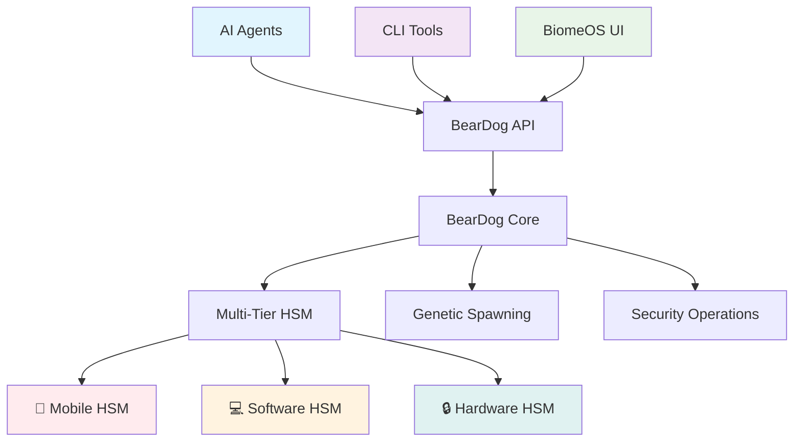

# BearDog: AI-First Security Infrastructure

**Pure Rust • Machine-Readable • Automation-Friendly • No UI Bottlenecks**

> *"Democratizing enterprise-grade security for everyone through AI-optimized interfaces"*

## 🤖 AI-First Architecture

BearDog is designed as **pure infrastructure** with **zero UI components**. All interactions happen through:

- **REST API** - Machine-readable JSON responses
- **CLI Tools** - Batch processing and automation
- **Streaming APIs** - Real-time event processing
- **Comprehensive Error Codes** - Retry logic and automation

### UI Philosophy: BiomeOS Handles Human Interface

```rust
// ❌ No UI components in BearDog
// ✅ Pure API/CLI infrastructure
// ✅ BiomeOS provides human interface
// ✅ AI agents consume APIs directly
```

## 🏗️ Architecture Overview



## 🚀 Quick Start

### 1. AI-First CLI Demo

```bash
# Run comprehensive AI-first demo
cargo run --example ai_cli_demo

# Output: Pure JSON, machine-readable
{
  "success": true,
  "data": {
    "system_status": { ... },
    "batch_operations": { ... },
    "genetic_spawning": { ... },
    "hsm_operations": { ... },
    "performance_benchmark": { ... }
  },
  "execution_time_ms": 245,
  "timestamp": "2025-01-27T10:30:00Z"
}
```

### 2. Distributed BearDog Setup

```bash
# Set up distributed instances
cargo run --example distributed_beardog_demo

# Your house continues to function even when the key isn't present!
```

### 3. CLI Operations

```bash
# System status (machine-readable)
./beardog ai system status --format json

# Batch security operations
./beardog ai security batch --operations-file ops.json --output results.json

# Genetic spawning
./beardog ai genetics spawn --parent node_001 --purpose LocalProcessing
```

## 🔧 API Endpoints

### Core API (`/ai/v1/`)

```rust
// System Operations
GET    /ai/v1/system/status        // Comprehensive system status
GET    /ai/v1/system/health        // Health check
GET    /ai/v1/system/metrics       // Performance metrics

// Security Operations
POST   /ai/v1/security/encrypt     // Encrypt data
POST   /ai/v1/security/decrypt     // Decrypt data
POST   /ai/v1/security/sign        // Sign data
POST   /ai/v1/security/verify      // Verify signature
POST   /ai/v1/security/batch       // Batch security operations

// Genetic Operations
POST   /ai/v1/genetics/spawn       // Spawn new node
POST   /ai/v1/genetics/spawn/batch // Batch spawning
GET    /ai/v1/genetics/status/:id  // Get spawn status

// HSM Operations
GET    /ai/v1/hsm/status           // HSM status
GET    /ai/v1/hsm/tiers            // Available HSM tiers
POST   /ai/v1/hsm/select-tier      // Select HSM tier

// Streaming (Server-Sent Events)
GET    /ai/v1/stream/events        // Event stream
GET    /ai/v1/stream/metrics       // Metrics stream
```

### Response Format

All API responses use a consistent format:

```json
{
  "success": true,
  "data": { ... },
  "error": {
    "code": "ERROR_CODE",
    "message": "Human-readable message",
    "category": "error_category",
    "retry_strategy": {
      "should_retry": true,
      "delay_ms": 1000,
      "max_attempts": 3,
      "backoff_strategy": "exponential"
    }
  },
  "request_id": "uuid",
  "processing_time_ms": 123,
  "metadata": { ... }
}
```

## 🧬 Genetic Spawning

BearDog nodes can spawn child nodes with genetic recombination:

```rust
// Spawn request
{
  "parent_id": "beardog_001",
  "co_parents": ["beardog_002"],
  "purpose": "LocalProcessing",
  "resource_requirements": {
    "cpu_percent": 50.0,
    "memory_mb": 2048
  },
  "workflow_type": "AutomatedConsensus"
}

// Spawn response
{
  "approved": true,
  "child_id": "beardog_003",
  "genetic_traits": {
    "generation": 2,
    "fitness_score": 0.85,
    "inherited_capabilities": ["encryption", "signing"],
    "mutations": ["performance_optimization"]
  },
  "decision_reason": "Automated approval - resources available"
}
```

## 🔐 Multi-Tier HSM Architecture

### HSM Tier Priority

1. **Mobile HSM** (Pixel 8 StrongBox) - High-security human identity
2. **Software HSM** (Rust-based) - Always available, routine operations
3. **Hardware HSM** (PKCS#11) - Maximum security when needed

### Operation Routing

```rust
// Intelligent routing based on security requirements
{
  "routing_strategy": {
    "human_identity": "mobile_hsm_preferred",
    "file_encryption": "software_hsm_optimized",
    "genetic_spawning": "software_hsm_optimized", 
    "backup_operations": "software_hsm_optimized"
  },
  "performance": {
    "mobile_hsm": "50-200ms latency, 100-500 ops/sec",
    "software_hsm": "0.1-1ms latency, 10,000+ ops/sec",
    "optimization": "95% latency reduction for routine ops"
  }
}
```

## 📊 Performance Characteristics

### Benchmark Results

```json
{
  "encryption": {
    "avg_time_ms": 1.2,
    "operations_per_second": 12000,
    "success_rate": 99.9
  },
  "signing": {
    "avg_time_ms": 3.4,
    "operations_per_second": 8500,
    "success_rate": 99.8
  },
  "genetic_spawning": {
    "avg_time_ms": 45.0,
    "operations_per_second": 125,
    "success_rate": 98.5
  }
}
```

### Distributed Performance

```rust
// Local network benefits
{
  "local_network": {
    "latency_between_instances": "<1ms",
    "bandwidth": "Gigabit",
    "internet_dependency": "None for routine ops"
  },
  "hsm_routing": {
    "routine_operations": "Local software HSM",
    "high_security": "Mobile HSM when available",
    "graceful_degradation": "Always functional"
  }
}
```

## 🔄 Batch Processing

### Batch Security Operations

```rust
// Batch request
{
  "operations": [
    {
      "operation": "encrypt",
      "key_id": "key_001",
      "data": "sensitive_data",
      "algorithm": "AES256"
    },
    // ... more operations
  ],
  "max_parallel": 10,
  "continue_on_error": true
}

// Batch response
{
  "summary": {
    "total_operations": 100,
    "successful_operations": 98,
    "failed_operations": 2,
    "success_rate": 98.0,
    "total_time_ms": 1234,
    "operations_per_second": 81.2
  },
  "results": [ ... ]
}
```

## 🛠️ Development

### Build & Test

```bash
# Build BearDog
cargo build --release

# Run tests
cargo test

# Run AI-first demo
cargo run --example ai_cli_demo

# Run distributed demo
cargo run --example distributed_beardog_demo

# Build CLI
cargo build --release --bin beardog-cli
```

### Project Structure

```
beardog/
├── crates/
│   ├── beardog-api/          # AI-First API layer
│   ├── beardog-cli/          # Machine-readable CLI
│   ├── beardog-core/         # Core orchestration
│   ├── beardog-genetics/     # Genetic spawning
│   ├── beardog-tunnel/       # HSM integration
│   └── beardog-security/     # Security operations
├── examples/
│   ├── ai_cli_demo.rs        # AI-first CLI demo
│   ├── distributed_beardog_demo.rs  # Distributed setup
│   └── biomeos_mobile_integration_demo.rs  # Mobile HSM
└── docs/                     # Documentation
```

## 🎯 Use Cases

### 1. AI Agent Automation

```rust
// AI agents consume BearDog APIs directly
let response = client.post("/ai/v1/security/batch")
    .json(&batch_request)
    .send()
    .await?;

// Machine-readable response with retry logic
if !response.success {
    if response.error.retry_strategy.should_retry {
        // Implement retry with backoff
    }
}
```

### 2. Infrastructure as Code

```rust
// BearDog operations in CI/CD pipelines
beardog ai security encrypt --key-id prod_key --data "$SECRET" --output encrypted.json
beardog ai genetics spawn --parent prod_node --purpose BackupRecovery --output spawn_result.json
```

### 3. Distributed Edge Computing

```rust
// Local instances coordinate automatically
{
  "tower_instance": "Heavy computation processing",
  "laptop_instance": "Quick access and mobility",
  "server_instance": "Backup and storage operations",
  "mobile_hsm": "High-security operations when present"
}
```

## 🔒 Security Features

### Zero-Trust Architecture

- **No implicit trust** - All operations validated
- **Multi-tier authentication** - HSM-backed identity
- **Audit trails** - Complete operation logging
- **Compliance ready** - SOX, GDPR, PCI-DSS support

### Graceful Degradation

```rust
// System continues operating even when mobile HSM unavailable
{
  "hsm_available": {
    "security_level": "High",
    "operations": "All operations available"
  },
  "hsm_unavailable": {
    "security_level": "Standard", 
    "operations": "Routine operations continue",
    "fallback": "Software HSM ensures continuity"
  }
}
```

## 🌐 Ecosystem Integration

### SongBird Service Mesh

BearDog registers as a security provider in the SongBird ecosystem:

```rust
// Automatic service discovery and routing
{
  "service_type": "security_provider",
  "capabilities": ["encryption", "signing", "genetic_spawning"],
  "health_endpoint": "/ai/v1/system/health",
  "load_balancing": "Handled by SongBird",
  "discovery": "Automatic registration"
}
```

### BiomeOS Integration

```rust
// BiomeOS provides human interface
{
  "beardog_role": "Pure API/CLI infrastructure",
  "biomeos_role": "Human interface and visualization",
  "separation": "Clear separation of concerns",
  "integration": "BiomeOS consumes BearDog APIs"
}
```

## 📈 Monitoring & Observability

### Metrics Collection

```rust
// Comprehensive metrics available via API
{
  "system_metrics": {
    "cpu_usage_percent": 15.2,
    "memory_usage_mb": 245,
    "active_connections": 42,
    "requests_per_second": 1250.0
  },
  "security_metrics": {
    "encryption_operations_per_second": 12000,
    "signing_operations_per_second": 8500,
    "hsm_operations_per_second": 1000
  },
  "genetic_metrics": {
    "active_spawns": 5,
    "successful_spawns": 245,
    "spawn_success_rate": 98.5
  }
}
```

### Health Monitoring

```rust
// Continuous health monitoring
{
  "health_status": "Healthy",
  "components": {
    "encryption_engine": "Healthy",
    "hsm_manager": "Healthy", 
    "genetic_spawner": "Healthy",
    "api_server": "Healthy"
  },
  "uptime_seconds": 86400,
  "last_check": "2025-01-27T10:30:00Z"
}
```

## 🎉 Why AI-First?

### 1. **No Human Bottlenecks**
- All operations machine-readable
- Batch processing for efficiency
- Comprehensive error handling
- Automated retry logic

### 2. **Automation-Friendly**
- JSON-only responses
- Consistent API patterns
- No interactive prompts
- CI/CD pipeline ready

### 3. **Performance Optimized**
- Local software HSM: <1ms latency
- Batch operations: 10,000+ ops/sec
- Distributed coordination: Sub-millisecond
- Graceful degradation: Always available

### 4. **Pure Rust Benefits**
- Memory safety
- Zero-cost abstractions
- High performance
- Fearless concurrency

---

## 🚀 Get Started

```bash
# Clone and build
git clone https://github.com/ecoprimal/beardog
cd beardog
cargo build --release

# Run AI-first demo
cargo run --example ai_cli_demo

# Your house continues to function even when the key isn't present! 🏠
```

**BearDog: Where AI meets enterprise security, powered by pure Rust.** 