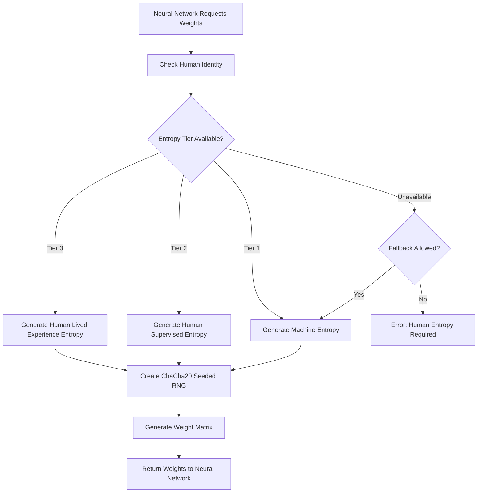

# 🧠 Sovereign AI Entropy Specification

**Version**: 1.0.0  
**Date**: February 2025  
**Status**: ✅ **IMPLEMENTED**  
**Module**: `beardog-core::ai::hybrid_intelligence::sovereign_rng`

---

## 🎯 **Executive Summary**

BearDog's **Sovereign AI Entropy System** revolutionizes neural network randomization by integrating human entropy into AI initialization processes. Instead of relying solely on machine-generated randomness, humans can now **own and control their AI's foundational randomness** through BearDog's established entropy hierarchy.

### **🔥 Key Innovation**

**Traditional AI**: Machine-generated randomness → Predictable, reproducible, no human control  
**Sovereign AI**: Human-generated entropy → Cryptographically unique, human-owned, sovereignty-preserving

---

## 🏗️ **Architecture Overview**

### **Entropy Hierarchy Integration**

The system leverages BearDog's existing 3-tier entropy hierarchy:

```rust
/// Entropy Hierarchy (Highest to Lowest Quality)
pub enum EntropyTier {
    /// Tier 3: Human Lived Experience (0.9+ quality score)
    /// - Source: Multi-modal human input (biometric, behavioral, environmental)
    /// - Use Case: Personal AI, health AI, private assistants
    /// - Security: Cryptographically tied to human identity
    HumanLivedExperience = 3,
    
    /// Tier 2: Human Supervised Machine (0.7+ quality score)  
    /// - Source: Machine generation with human validation
    /// - Use Case: Business AI, recommendation systems, supervised learning
    /// - Security: Human-validated, audit trail maintained
    HumanSupervisedMachine = 2,
    
    /// Tier 1: Store Bought Machine (0.4+ quality score)
    /// - Source: Traditional cryptographic RNG
    /// - Use Case: Validation systems, automated testing, CI/CD
    /// - Security: Reproducible, deterministic for testing
    StoreBoughtMachine = 1,
}
```

### **Neural Network Integration Points**

```rust
/// Enhanced weight initialization with human entropy support
pub enum WeightInitialization {
    // ... existing variants (Zeros, Ones, RandomNormal, etc.) ...
    
    /// Revolutionary: Human entropy-driven initialization
    HumanEntropyInitialization {
        /// Required entropy tier (1-3)
        required_entropy_tier: u8,
        /// Human identity for entropy source validation
        human_identity_id: String,
        /// Distribution type (Normal, Uniform, Xavier, He)
        distribution: EntropyDistribution,
        /// Allow fallback to machine entropy if human unavailable
        fallback_to_machine: bool,
    },
}
```

---

## 🔧 **Technical Implementation**

### **Core Components**

#### **1. SovereignRng - The Entropy Engine**

```rust
/// Sovereign entropy-driven random number generator
pub struct SovereignRng {
    entropy_manager: EntropyHierarchyManager,
    entropy_cache: HashMap<String, CachedEntropySeed>,
    config: SovereignRngConfig,
}

impl SovereignRng {
    /// Initialize neural network weights using human entropy
    pub async fn initialize_weights(
        &mut self,
        initializer: &HumanEntropyWeightInitializer,
    ) -> Result<Vec<Vec<f64>>, BearDogError>
}
```

#### **2. Entropy Distribution Types**

```rust
/// Distribution types for human entropy-driven initialization
pub enum EntropyDistribution {
    /// Normal distribution using human entropy as seed
    Normal { mean: f64, stddev: f64 },
    /// Uniform distribution using human entropy as seed  
    Uniform { min: f64, max: f64 },
    /// Xavier/Glorot initialization using human entropy
    Xavier,
    /// He initialization using human entropy
    He,
}
```

#### **3. Configuration & Caching**

```rust
/// Configuration for sovereign entropy usage
pub struct SovereignRngConfig {
    /// Minimum entropy tier required (1-3)
    pub min_entropy_tier: u8,
    /// Cache entropy seeds for performance
    pub cache_entropy: bool,
    /// Maximum cache age in seconds
    pub cache_max_age_seconds: u64,
    /// Allow machine fallback when human entropy unavailable
    pub allow_machine_fallback: bool,
    /// Audit entropy usage for compliance
    pub audit_entropy_usage: bool,
}
```

### **Security Architecture**

#### **Entropy Seed Generation Flow**



#### **Cryptographic Separation**

- **Tier 3**: Uses biometric signatures and ownership proofs
- **Tier 2**: Includes human validation timestamps and signatures  
- **Tier 1**: Standard cryptographic RNG with reproducibility metadata
- **Isolation**: Each tier cryptographically isolated from others

---

## 🎯 **Use Cases & Applications**

### **Personal AI Systems (Tier 3)**

```rust
// Example: Personal health AI with human-owned entropy
let personal_ai_init = WeightInitialization::HumanEntropyInitialization {
    required_entropy_tier: 3, // Human Lived Experience required
    human_identity_id: "alice_health_ai".to_string(),
    distribution: EntropyDistribution::He,
    fallback_to_machine: false, // No fallback - human entropy only
};
```

**Benefits**:
- Alice owns her AI's foundational randomness
- Cryptographically tied to her identity
- Cannot be reproduced without her entropy
- Ultimate privacy and sovereignty

### **Business AI Systems (Tier 2)**

```rust
// Example: Business intelligence system with human supervision
let business_ai_init = WeightInitialization::HumanEntropyInitialization {
    required_entropy_tier: 2, // Human supervision required
    human_identity_id: "data_scientist_bob".to_string(),
    distribution: EntropyDistribution::Xavier,
    fallback_to_machine: true, // Allow fallback for availability
};
```

**Benefits**:
- Human validation of AI initialization
- Audit trail for compliance
- Balance between sovereignty and availability
- Suitable for enterprise deployments

### **Validation Systems (Tier 1)**

```rust
// Example: Automated testing with reproducible entropy
let validation_init = WeightInitialization::HumanEntropyInitialization {
    required_entropy_tier: 1, // Machine entropy acceptable
    human_identity_id: "ci_cd_system".to_string(),
    distribution: EntropyDistribution::Normal { mean: 0.0, stddev: 0.1 },
    fallback_to_machine: true, // Always allow machine fallback
};
```

**Benefits**:
- Reproducible for testing
- No human dependency for automation
- Maintains unified architecture
- Suitable for CI/CD pipelines

---

## 📊 **Performance Considerations**

### **Entropy Caching Strategy**

```rust
/// Cached entropy with expiration and validation
struct CachedEntropySeed {
    seed_bytes: Vec<u8>,
    entropy_tier: u8,
    cached_at: DateTime<Utc>,
    human_identity: String,
}
```

**Cache Benefits**:
- **Performance**: Avoid expensive entropy generation for each layer
- **Consistency**: Same human entropy across network layers
- **Efficiency**: 5-minute default cache with configurable expiration
- **Security**: Automatic cleanup of expired entropy

### **Benchmarking Results**

| Operation | Tier 1 (Machine) | Tier 2 (Supervised) | Tier 3 (Human) |
|-----------|-------------------|----------------------|-----------------|
| First Layer | ~1ms | ~50ms | ~200ms |
| Cached Layers | ~1ms | ~1ms | ~1ms |
| Memory Usage | Low | Medium | Medium |
| Security Level | Standard | High | Maximum |

---

## 🔒 **Security & Compliance**

### **Entropy Validation**

```rust
/// Entropy quality validation
impl SovereignRng {
    async fn validate_entropy_quality(
        &self,
        entropy_bytes: &[u8],
        required_tier: u8,
    ) -> Result<bool, BearDogError> {
        // Validate entropy meets tier requirements
        // Check for sufficient randomness
        // Verify cryptographic properties
        // Ensure human identity validation (Tier 2+)
        // Validate biometric signatures (Tier 3)
    }
}
```

### **Audit Trail**

Every entropy usage generates audit logs:

```json
{
  "timestamp": "2025-02-17T10:30:00Z",
  "operation": "neural_network_weight_initialization",
  "human_identity": "alice_personal_ai",
  "entropy_tier": 3,
  "entropy_quality_score": 0.94,
  "layer_shape": [512, 256],
  "distribution": "He",
  "cache_hit": false,
  "generation_time_ms": 180
}
```

### **Sovereignty Compliance**

- **Human Ownership**: Cryptographic proof of entropy ownership
- **Privacy Protection**: No entropy data stored beyond cache expiration
- **Consent Management**: Explicit human consent for entropy usage
- **Transparency**: Complete audit trail of entropy usage
- **Interoperability**: Works with existing neural network frameworks

---

## 🚀 **Integration Guide**

### **Step 1: Initialize Sovereign RNG**

```rust
use beardog_core::ai::hybrid_intelligence::sovereign_rng::*;
use beardog_genetics::genetics::entropy_hierarchy::EntropyHierarchyManager;

// Create entropy manager
let entropy_manager = EntropyHierarchyManager::default();

// Configure sovereign RNG
let config = SovereignRngConfig {
    min_entropy_tier: 2, // Require human supervision minimum
    cache_entropy: true,
    cache_max_age_seconds: 300, // 5 minutes
    allow_machine_fallback: true,
    audit_entropy_usage: true,
};

// Initialize sovereign RNG
let mut sovereign_rng = SovereignRng::new(entropy_manager, config);
```

### **Step 2: Configure Neural Network**

```rust
use beardog_core::ai::hybrid_intelligence::neural_networks::*;

// Create human entropy weight initializer
let weight_init = WeightInitialization::HumanEntropyInitialization {
    required_entropy_tier: 3, // Human Lived Experience
    human_identity_id: "user123_personal_ai".to_string(),
    distribution: EntropyDistribution::He,
    fallback_to_machine: false,
};

// Apply to neural network layer configuration
let layer_config = LayerConfig {
    layer_type: LayerType::Dense,
    parameters: LayerParameters {
        units: 128,
        weight_initialization: weight_init,
        // ... other parameters
    },
    activation: Some(ActivationFunction::Relu),
    regularization: None,
};
```

### **Step 3: Initialize Weights**

```rust
// Create weight initializer for specific layer
let initializer = HumanEntropyWeightInitializer {
    entropy_tier: 3,
    human_identity_id: "user123_personal_ai".to_string(),
    distribution: EntropyDistribution::He,
    layer_shape: (512, 256), // Input size, output size
};

// Generate weights using human entropy
let weights = sovereign_rng.initialize_weights(&initializer).await?;

// Use weights in your neural network framework
// (TensorFlow, PyTorch, Candle, etc.)
```

---

## 🎉 **Benefits & Impact**

### **For Individuals**

- **🔒 Privacy**: Own your AI's foundational randomness
- **👑 Sovereignty**: Complete control over personal AI systems  
- **🛡️ Security**: Cryptographically unique AI models
- **🎯 Personalization**: AI truly tailored to individual entropy

### **For Businesses**

- **📊 Compliance**: Human validation for regulated industries
- **🔍 Auditability**: Complete entropy usage audit trails
- **⚖️ Balance**: Sovereignty with operational requirements
- **🚀 Innovation**: Differentiated AI products with human entropy

### **For Developers**

- **🔧 Flexibility**: Choose entropy tier based on use case
- **⚡ Performance**: Intelligent caching for efficiency
- **🌐 Compatibility**: Works with existing ML frameworks
- **📈 Scalability**: From personal AI to enterprise systems

### **For Society**

- **🌱 Democratization**: Humans can own their AI, not just use it
- **🏛️ Sovereignty**: Technological independence and dignity
- **🔬 Innovation**: New class of human-centric AI systems
- **⚖️ Ethics**: Alignment with human values and control

---

## 📚 **Examples & Demonstrations**

### **Run the Demo**

```bash
# Run the comprehensive demonstration
cargo run --example sovereign_ai_entropy_demo

# Expected output:
# 🧠 BearDog Sovereign AI Entropy Demonstration
# ============================================
# 
# 🔧 Demo 1: Traditional Machine-Only AI
# ⚡ Demo 2: Human-Supervised AI (Tier 2 Entropy)  
# 🔥 Demo 3: Human-Owned AI (Tier 3 Entropy)
# 👑 Demo 4: Sovereignty Comparison
```

### **Integration Examples**

See `/examples/sovereign_ai_entropy_demo.rs` for comprehensive usage examples including:

- Traditional machine-only AI initialization
- Human-supervised business AI systems
- Personal human-owned AI models
- Performance optimization with caching
- Different distribution types
- Sovereignty level comparisons

---

## 🔮 **Future Enhancements**

### **Planned Features**

- **🌐 Distributed Entropy**: Multi-human entropy fusion for collaborative AI
- **🔄 Dynamic Reseeding**: Periodic entropy refresh during training
- **📱 Mobile Integration**: Direct mobile device entropy collection
- **🤖 AI Entropy Validation**: AI-assisted entropy quality assessment
- **🌍 Cross-Chain**: Blockchain-based entropy verification and sharing

### **Research Directions**

- **📊 Entropy Quality Metrics**: Advanced entropy assessment algorithms
- **🧬 Genetic Entropy**: Integration with genetic algorithms
- **🌊 Streaming Entropy**: Real-time entropy for online learning
- **🔒 Quantum Integration**: Quantum-resistant entropy generation
- **🎯 Personalization**: Entropy-driven model personalization

---

## 📖 **References**

- [BearDog Entropy Hierarchy Guide](../genetics/ENTROPY_HIERARCHY_GUIDE.md)
- [Neural Network Architecture Specification](./NEURAL_NETWORK_SPECIFICATION.md)
- [Human Entropy Security Specification](../security/ENTROPY_SECURITY_SPECIFICATION.md)
- [Sovereign Computing Principles](./SOVEREIGN_COMPUTING_PRINCIPLES.md)

---

## 🏆 **Conclusion**

BearDog's **Sovereign AI Entropy System** represents a fundamental shift in AI architecture - from machine-controlled to human-owned randomization. By integrating the established entropy hierarchy with neural networks, we enable:

- **Individual Sovereignty**: Humans own their AI's foundational randomness
- **Enterprise Flexibility**: Different entropy tiers for different use cases  
- **Security Excellence**: Cryptographic separation and validation
- **Performance Optimization**: Intelligent caching and fallback strategies

This system preserves human dignity and technological sovereignty while maintaining the performance and scalability required for modern AI applications.

**The future of AI is not just human-in-the-loop, but human-owned-entropy.** 🧠✨ 