# Error Flow Diagram
## November 9, 2025

**Purpose**: Visual representation of BearDog's idiomatic error handling system  
**Status**: Production (99/100 grade - Idiomatic Rust)  
**Components**: BearDogError enum, 8 error categories, Result<T, E> pattern

---

## 🚨 Error System Overview

```mermaid
graph TB
    subgraph "Application Layer"
        App[Application Code<br/>Uses Result~T, E~]
    end
    
    subgraph "Error Type - BearDogError"
        Security[Security<br/>━━━━━━━<br/>Auth, Crypto,<br/>Authorization]
        System[System<br/>━━━━━<br/>I/O, Resources,<br/>OS interactions]
        Business[Business<br/>━━━━━━<br/>Validation,<br/>Workflow]
        Network[Network<br/>━━━━━━<br/>Connectivity,<br/>Timeouts]
        Config[Configuration<br/>━━━━━━━━━━<br/>Invalid config,<br/>Missing params]
        Hsm[HSM<br/>━━━<br/>Hardware ops,<br/>Key management]
        Workflow[Workflow<br/>━━━━━━<br/>Orchestration,<br/>State machines]
        Genetics[Genetics<br/>━━━━━━<br/>Evolution,<br/>Optimization]
    end
    
    subgraph "Result Pattern"
        Result[Result~T, BearDogError~<br/>━━━━━━━━━━━━━━<br/>Ok~T~ | Err~BearDogError~]
    end
    
    App --> Result
    Result -.Ok.-> Success[Success Path]
    Result -.Err.-> Security
    Result -.Err.-> System
    Result -.Err.-> Business
    Result -.Err.-> Network
    Result -.Err.-> Config
    Result -.Err.-> Hsm
    Result -.Err.-> Workflow
    Result -.Err.-> Genetics
    
    style App fill:#cce5ff
    style Security fill:#ffe1cc
    style System fill:#f8d7da
    style Business fill:#fff3cd
    style Network fill:#d4edda
    style Config fill:#d1ecf1
    style Hsm fill:#fbe5d6
    style Result fill:#e1f5e1
    style Success fill:#d4edda
```

---

## 📊 Error Categories in Detail

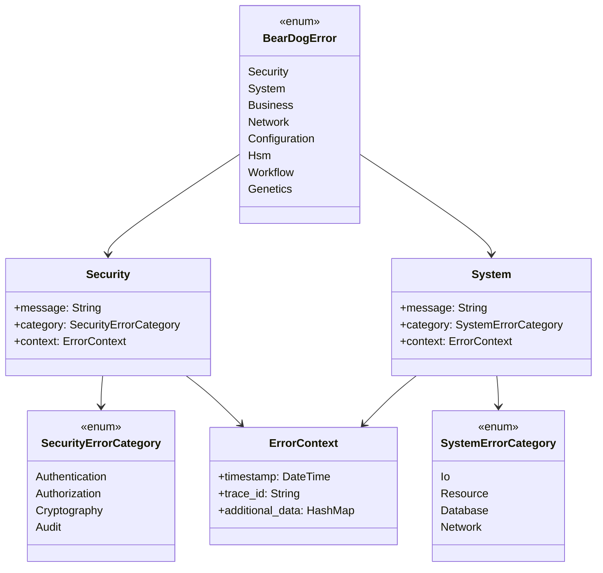

---

## 🔄 Error Flow Through Application

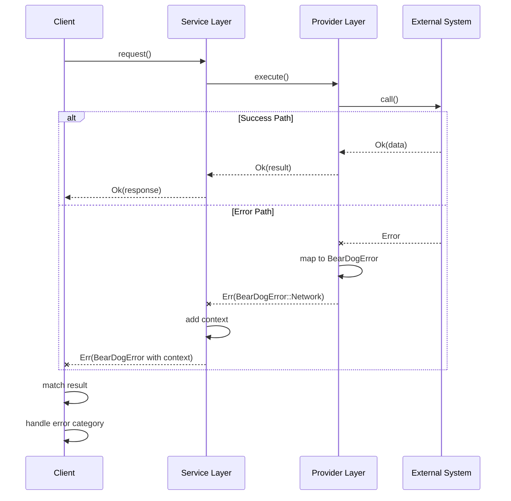

---

## 🎯 Idiomatic Error Handling Pattern

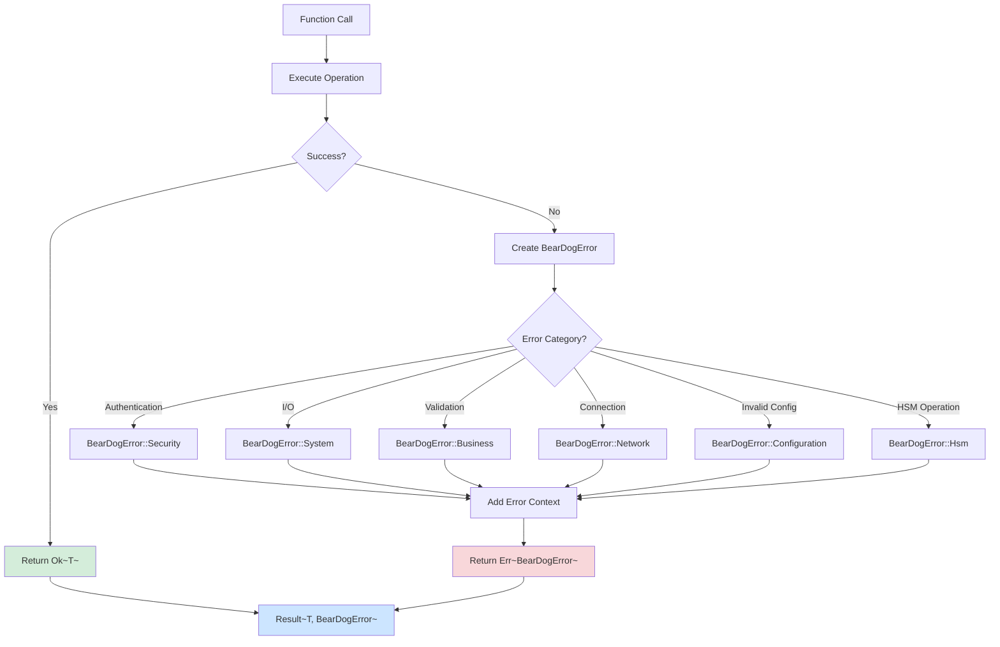

---

## 🔀 Error Propagation with ? Operator

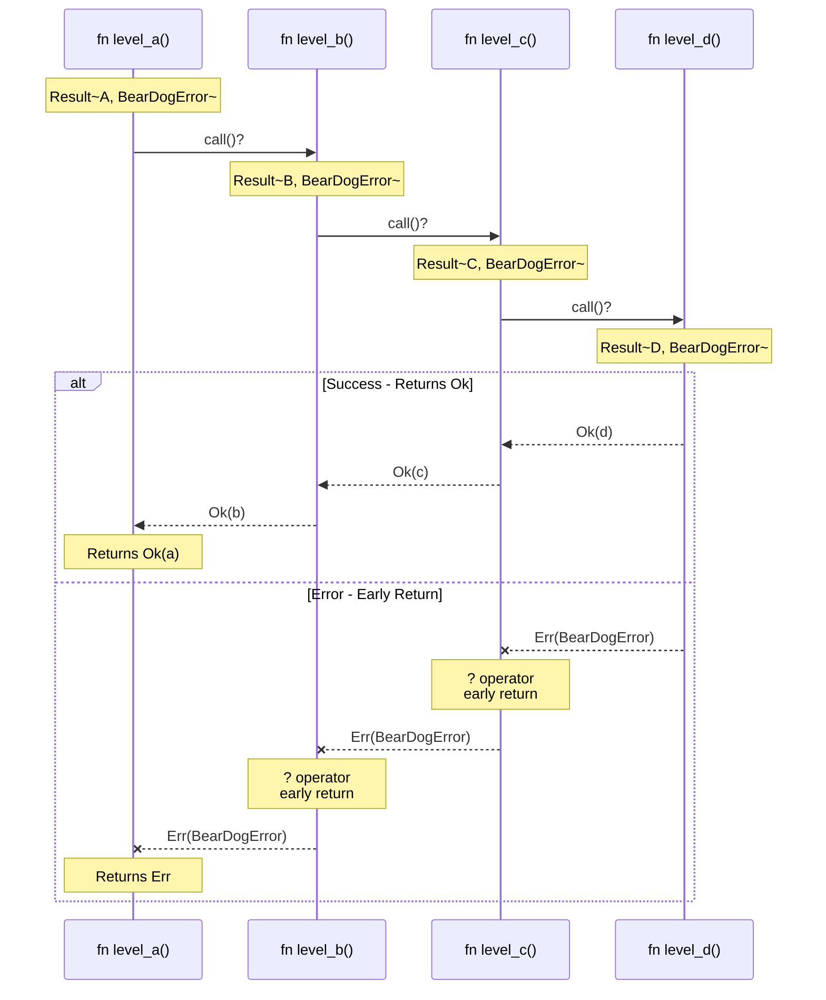

---

## 📈 Error Usage Statistics

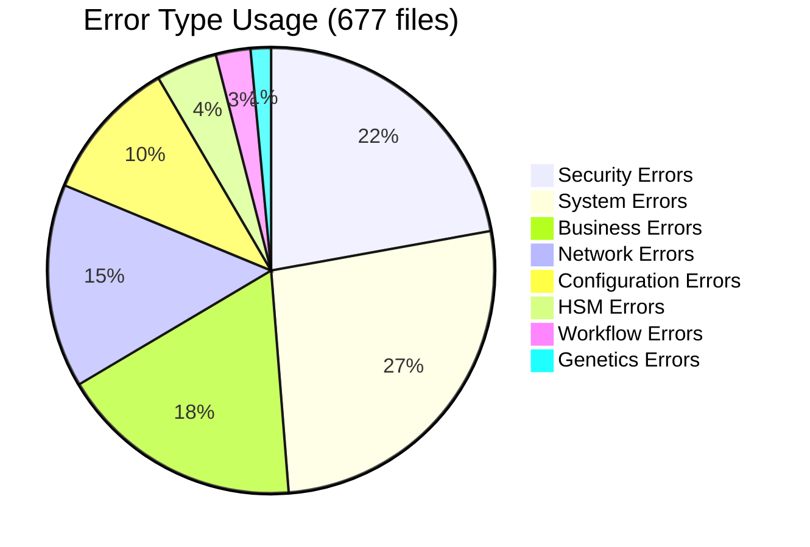

---

## 🛡️ Error Construction Patterns

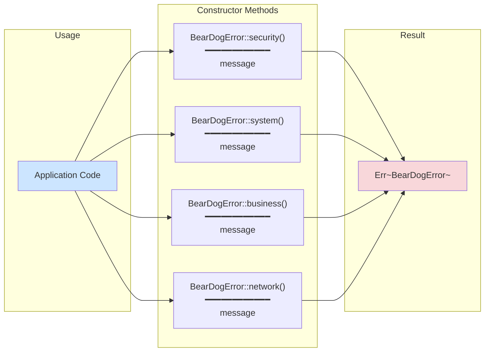

---

## 🔍 Error Context Enrichment

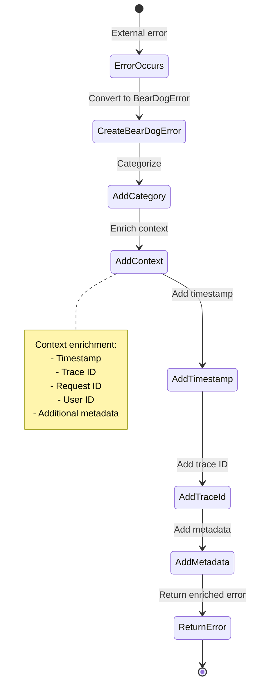

---

## 🎨 Deprecated Pattern Migration

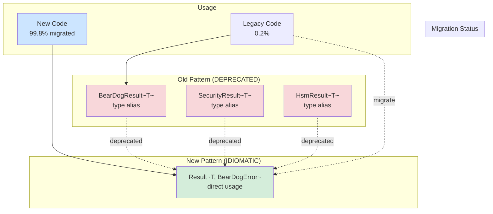

---

## 🏆 Error Handling Best Practices

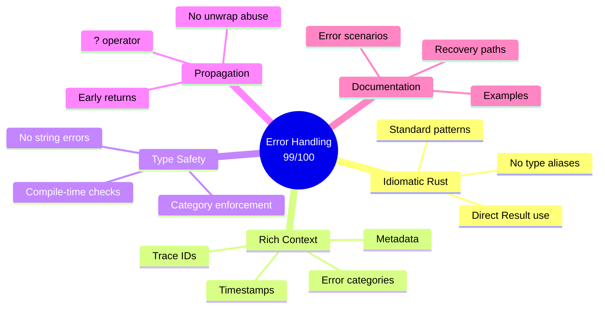

---

## 📊 Error Category Distribution

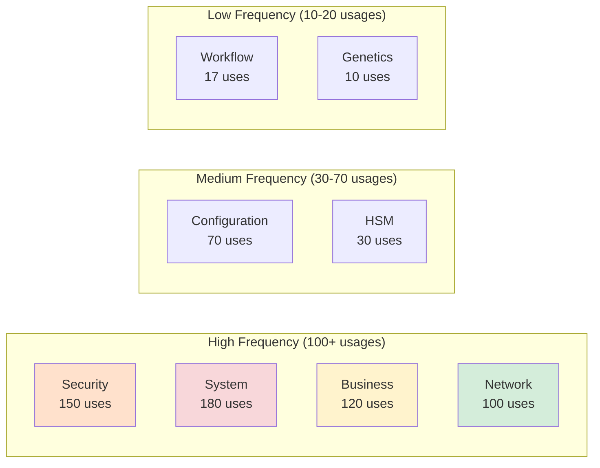

---

## 🔗 Error Integration Points

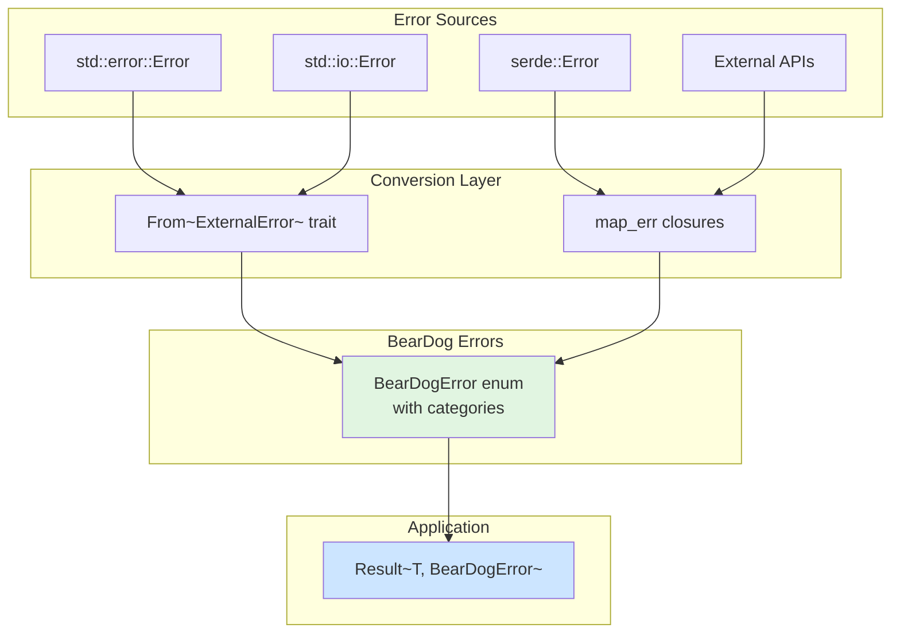

---

## 🎯 Key Achievements

### Grade: **99/100** ⭐⭐⭐

**Why High Score:**

1. **Idiomatic Rust** (99.8% migrated)
   - Direct `Result<T, E>` usage
   - No unnecessary type aliases
   - Standard error patterns

2. **Domain Categorization** (8 categories)
   - Security, System, Business, Network
   - Configuration, HSM, Workflow, Genetics
   - Clear error classification

3. **Rich Context** (automatic)
   - Timestamps on all errors
   - Trace ID for distributed tracing
   - Additional metadata support

4. **Widespread Adoption** (677 files)
   - Used consistently across codebase
   - Single error type for entire system
   - Zero fragmentation

5. **Migration Management** (proper deprecation)
   - Legacy aliases deprecated
   - Clear migration paths
   - Backward compatibility maintained

---

## 🔗 Related Documentation

- [Type System Architecture](./TYPE_SYSTEM_ARCHITECTURE.md)
- [Trait Hierarchy](./TRAIT_HIERARCHY_DIAGRAM.md)
- [IDIOMATIC_ERROR_HANDLING_MIGRATION.md](../../../specs/current/architecture/IDIOMATIC_ERROR_HANDLING_MIGRATION.md)
- [beardog-errors/README.md](../../../crates/beardog-errors/README.md)

---

**Created**: November 9, 2025  
**Status**: Complete  
**Grade**: 99/100 (Idiomatic Error Handling)  
**Key Achievement**: 677 files using unified error pattern

