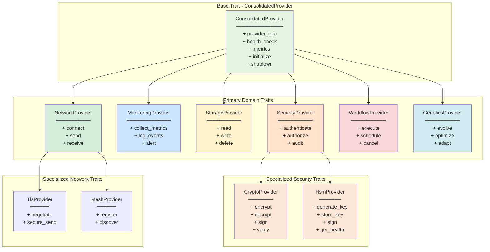
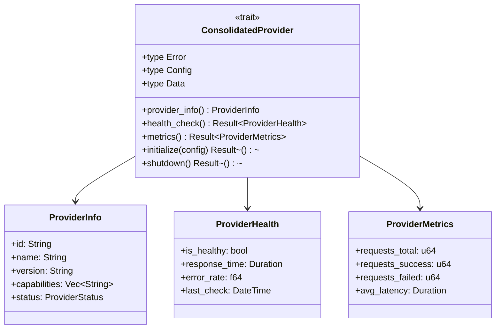
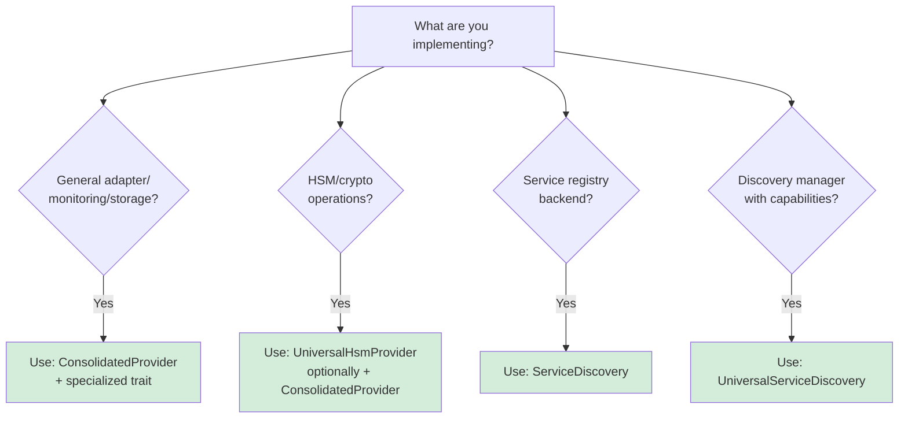
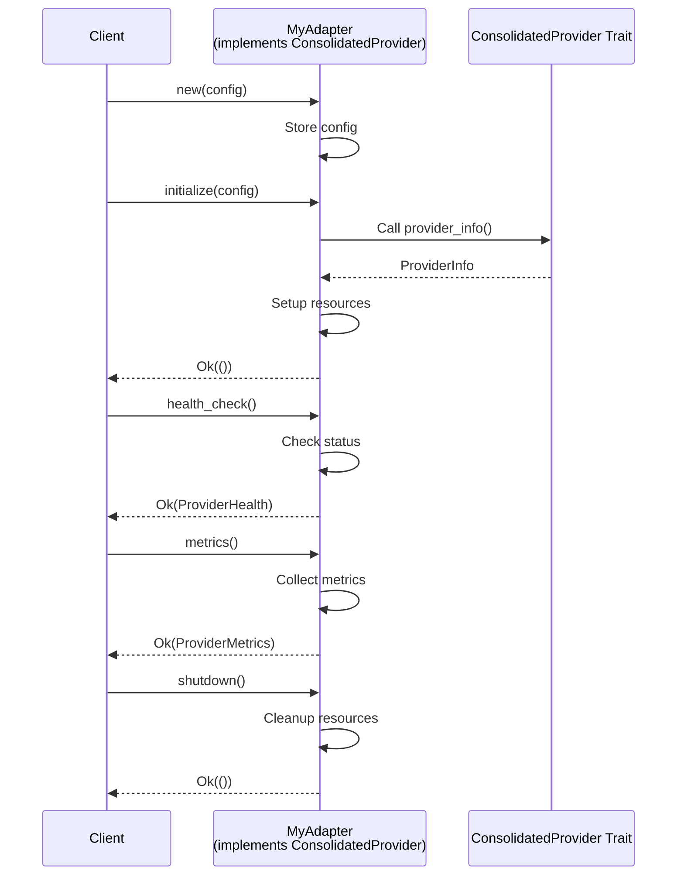
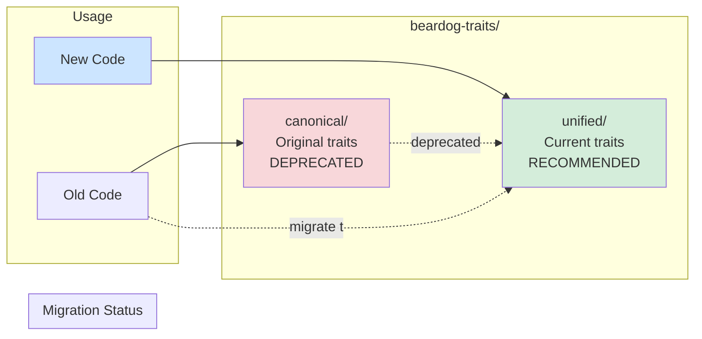
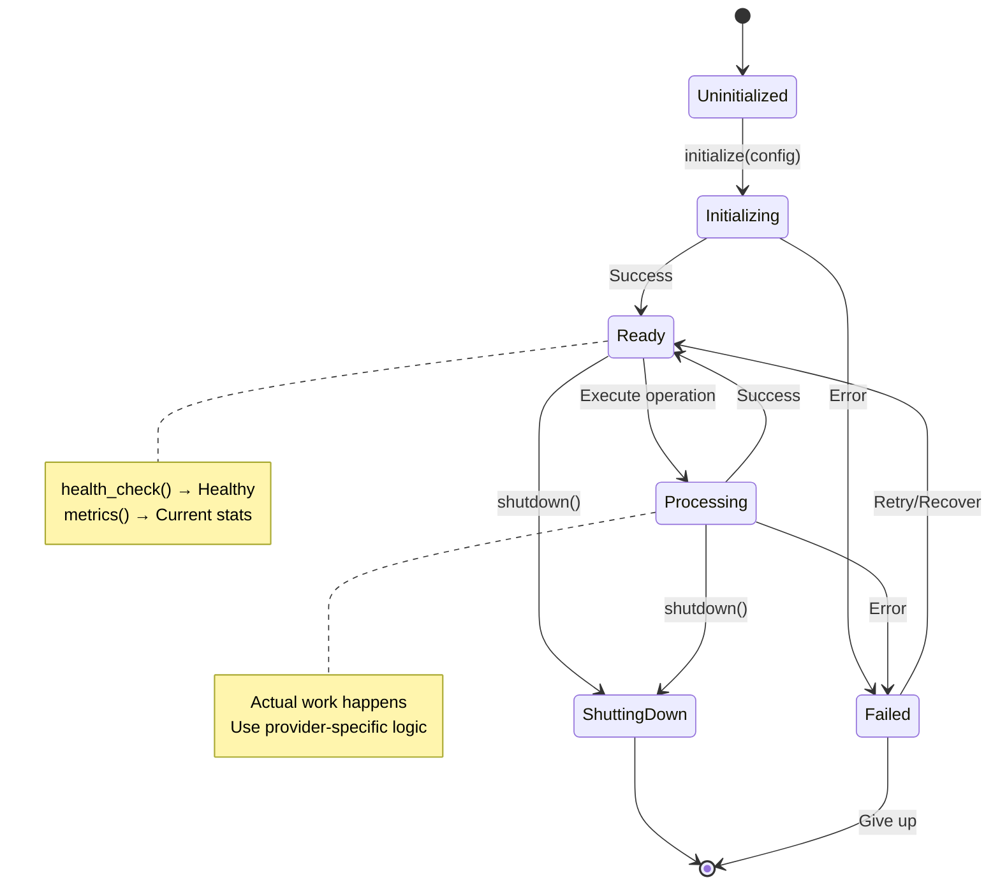
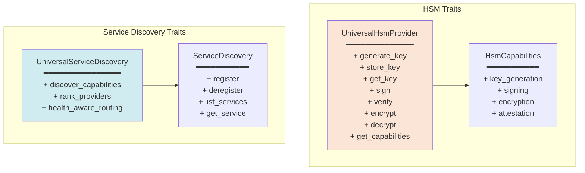
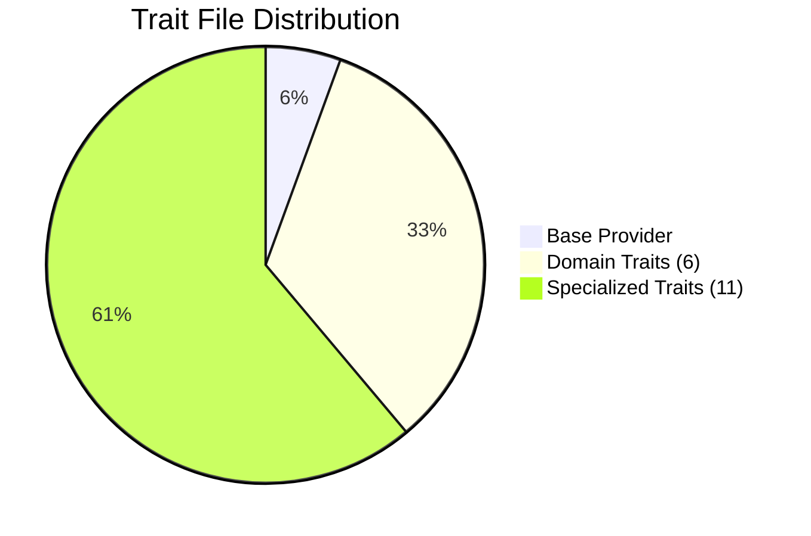
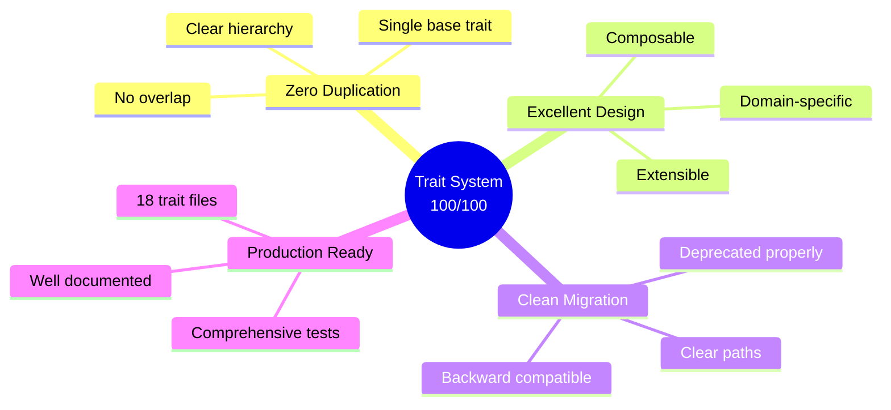
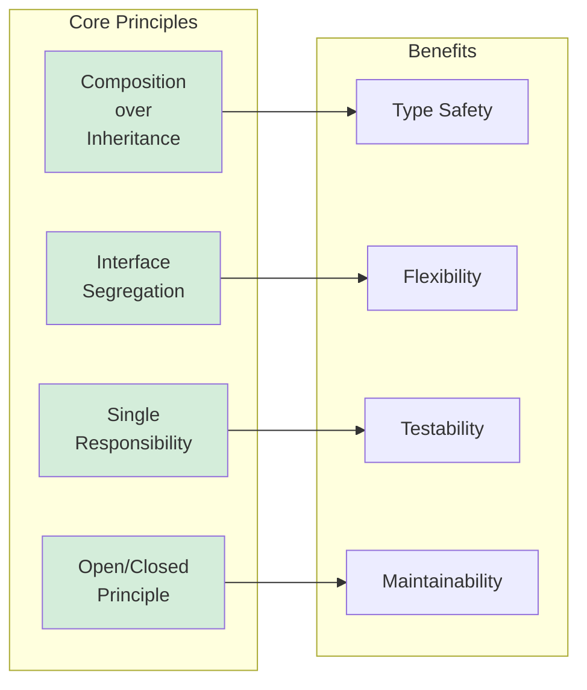

# Trait Hierarchy Diagram
## November 9, 2025

**Purpose**: Visual representation of BearDog's exemplary trait system  
**Status**: Production (100/100 grade - Reference Implementation)  
**Components**: 18 trait files, ConsolidatedProvider base, domain-specific extensions

---

## 🏛️ Complete Trait Hierarchy

---

## 🔀 ConsolidatedProvider Interface

---

## 🎯 Trait Selection Decision Tree

---

## 🏗️ Implementation Example

---

## 📊 Trait Organization

---

## 🎨 Provider Implementation Pattern

---

## 🔗 Domain-Specific Trait Extensions

---

## 📈 Trait Usage Statistics

---

## 🏆 Quality Metrics

### Trait System Grade: **100/100** ⭐⭐⭐

**Why Perfect Score:**

---

## 🎯 Design Principles

---

## 🔗 Related Documentation

- [Type System Architecture](./TYPE_SYSTEM_ARCHITECTURE.md)
- [Error Flow](./ERROR_FLOW_DIAGRAM.md)
- [TRAIT_HIERARCHY_GUIDE.md](../../guides/TRAIT_HIERARCHY_GUIDE.md)
- [SERVICE_DISCOVERY_TRAIT_GUIDE.md](../../guides/SERVICE_DISCOVERY_TRAIT_GUIDE.md)

---

**Created**: November 9, 2025  
**Status**: Complete  
**Grade**: 100/100 (Reference Implementation)  
**Key Achievement**: Exemplary trait design

