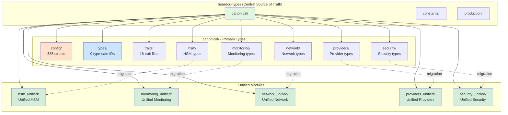
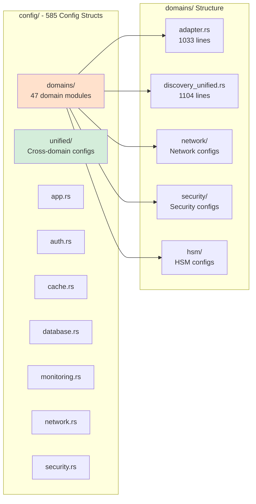
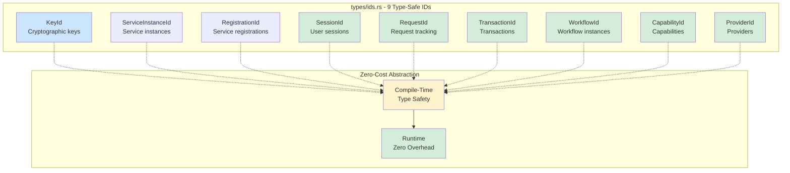
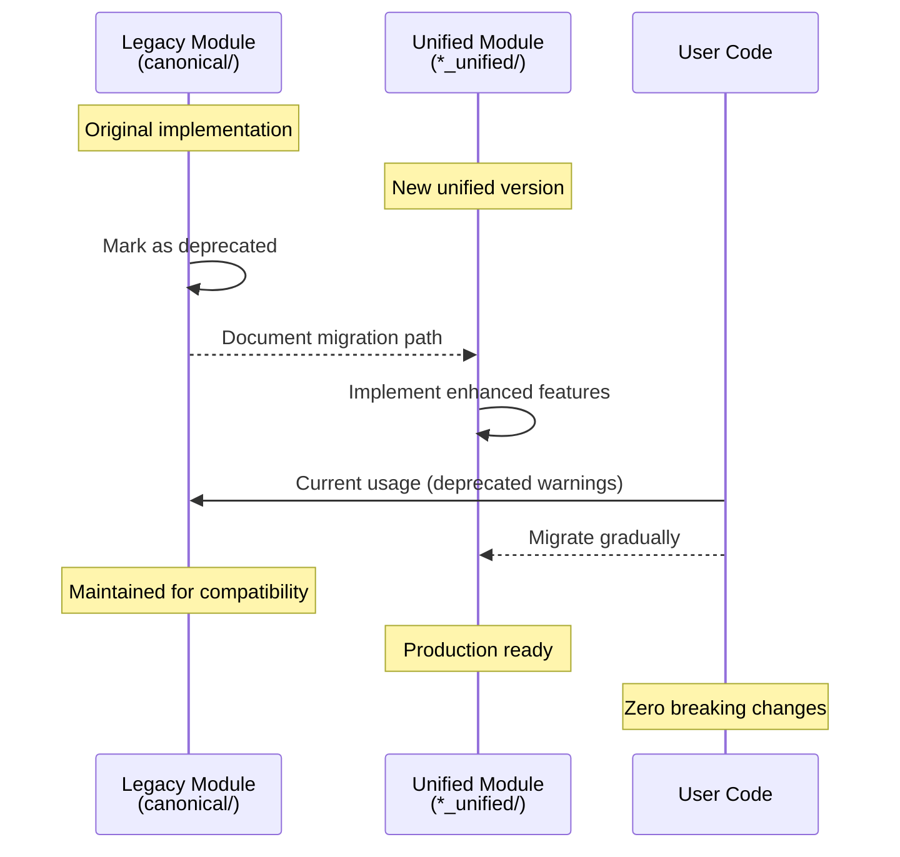
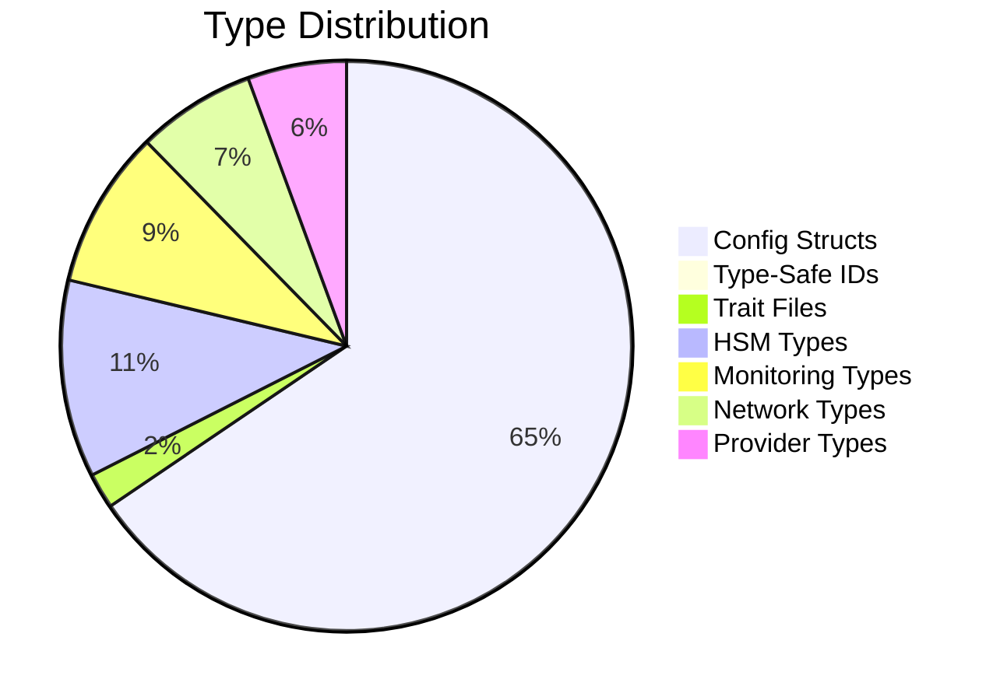
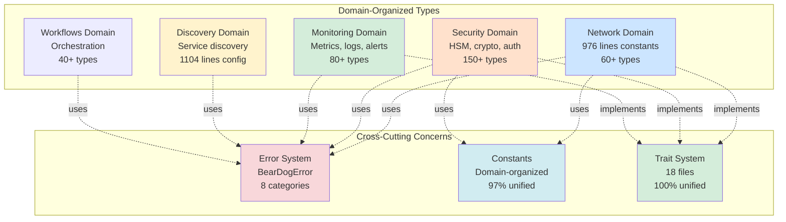

# Type System Architecture
## November 9, 2025

**Purpose**: Visual representation of BearDog's unified type system architecture  
**Status**: Production (99.7/100 grade)  
**Components**: 585 config structs, 9 ID types, unified organization

---

## 📊 High-Level Architecture

---

## 🗂️ Configuration System Details

---

## 🆔 Type-Safe ID System

---

## 🔀 Migration Pattern: canonical/ → unified/

---

## 📈 Type System Statistics

---

## 🏗️ Domain Organization

---

## 🎯 Key Benefits

### 1. **Single Source of Truth**
- All types in `beardog-types::canonical`
- Zero duplication in core types
- Clear ownership and organization

### 2. **Zero-Cost Abstractions**
- Type-safe IDs compile to raw strings
- No runtime overhead
- Compile-time type checking

### 3. **Migration-Friendly**
- Gradual migration path
- Backward compatibility maintained
- Clear deprecation strategy

### 4. **Domain Organization**
- 47 domain modules
- Logical grouping
- Easy navigation

### 5. **Production Ready**
- 585 config structs unified
- 9 type-safe IDs implemented
- 100% file size compliance

---

## 🔗 Related Documentation

- [Trait Hierarchy](./TRAIT_HIERARCHY_DIAGRAM.md)
- [Error Flow](./ERROR_FLOW_DIAGRAM.md)
- [ARCHITECTURE.md](../../ARCHITECTURE.md)
- [UNIFICATION_STATUS_ONE_PAGE_NOV_9_2025.md](../../../UNIFICATION_STATUS_ONE_PAGE_NOV_9_2025.md)

---

**Created**: November 9, 2025  
**Status**: Complete  
**Grade**: 99/100 (Type System)  
**Compliance**: 100% file size discipline

