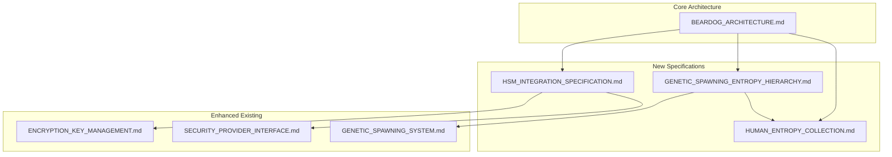

# BearDog Enhanced Specifications Summary

**Version**: 1.0  
**Date**: January 2025  
**Status**: SPECIFICATION COMPLETE  
**Priority**: EXECUTIVE SUMMARY  

## 🎯 Executive Summary

This document summarizes the comprehensive enhancement of BearDog's specifications, introducing **revolutionary entropy hierarchy concepts** and **multi-tier HSM integration**. These enhancements establish BearDog as the premier security platform for both personal and enterprise use.

## 🧬 New Specification Documents

### **1. Genetic Spawning Entropy Hierarchy**
**File**: `GENETIC_SPAWNING_ENTROPY_HIERARCHY.md`

#### **Key Innovations**
- **Human-Lived Experience Entropy**: Irreproducible entropy from human sensory input
- **Entropy Hierarchy**: Human entropy > Machine entropy (always)
- **Ephemeral Seeds**: Temporary, uniquely owned cryptographic seeds
- **Irreproducibility Proofs**: Cryptographic proof that entropy cannot be replicated

#### **Core Concepts**
```rust
pub enum EntropyClass {
    HumanLivedExperience,    // Highest tier - from human senses
    HumanSupervisedMachine,  // Mid tier - human-validated machine
    StoreBoughtMachine,      // Lowest tier - standard CSPRNG
}
```

#### **Entropy Mixing Rules**
1. **Human + Machine = Human** (human dominance)
2. **Human + Human = Enhanced Human** (amplified uniqueness)
3. **Machine + Machine = Machine** (standard crypto)

### **2. HSM Integration Specification**
**File**: `HSM_INTEGRATION_SPECIFICATION.md`

#### **Multi-Tier HSM Strategy**
- **Smartphone HSM**: iOS Secure Enclave, Android StrongBox
- **Software HSM**: Pure Rust implementation with memory protection
- **Hardware HSM**: Traditional enterprise HSMs (CloudHSM, Luna)
- **Hybrid HSM**: Intelligent tier selection and failover

#### **HSM Capability Matrix**
| HSM Type    | Security  | Availability | User Interaction | Cost    |
|-------------|-----------|--------------|------------------|---------|
| Smartphone  | High      | Always       | Excellent        | Low     |
| Software    | Medium    | Always       | None             | Minimal |
| Hardware    | Maximum   | Limited      | None             | High    |
| Hybrid      | Optimal   | High         | Flexible         | Medium  |

### **3. Human Entropy Collection**
**File**: `HUMAN_ENTROPY_COLLECTION.md`

#### **Multi-Modal Collection**
- **Microphone**: Ambient sound, voice patterns, environmental noise
- **Camera**: Lighting variations, motion patterns, visual entropy
- **Haptic**: Touch patterns, device orientation, pressure variations
- **Biometric**: Privacy-preserving biometric entropy extraction

#### **Privacy-First Design**
- **Data Minimization**: Only extract entropy-relevant features
- **Immediate Deletion**: Raw sensory data deleted after processing
- **Anonymization**: No identifiable information retained
- **Consent Management**: Explicit user consent for all collection

## 🔐 Enhanced Security Architecture

### **Entropy Hierarchy in Action**
```rust
// Example: Spawning with human entropy
let human_entropy = entropy_collector.collect_human_entropy(
    Duration::from_secs(30),
    vec![
        EntropySource::Microphone,
        EntropySource::Camera,
        EntropySource::Haptic,
    ],
).await?;

let child = genetic_spawner.spawn_with_entropy_hierarchy(
    parent_nodes,
    spawn_request,
    entropy_requirements,
).await?;

// Result: Child inherits human-hierarchy privileges
assert_eq!(child.entropy_class, EntropyClass::HumanLivedExperience);
```

### **HSM Integration Flow**
```rust
// Automatic HSM tier selection
let hsm = hsm_manager.select_optimal_hsm(
    &SecurityRequirements {
        security_level: SecurityLevel::High,
        user_interaction: true,
        cost_optimization: false,
    },
    &operation_context,
).await?;

// HSM performs cryptographic operations
let signature = hsm.sign(key_id, data).await?;
```

## 🏗️ Updated Architecture Components

### **Enhanced BearDogCore**
```rust
pub struct BearDogCore {
    // Original components
    pub encryption_engine: Arc<EncryptionEngine>,
    pub key_manager: Arc<KeyManager>,
    pub compliance_engine: Arc<ComplianceEngine>,
    
    // NEW: Entropy hierarchy components
    pub genetic_spawner: Arc<EntropyAwareGeneticSpawner>,
    pub entropy_collector: Arc<MultiModalEntropyCollector>,
    pub entropy_hierarchy: Arc<EntropyHierarchyManager>,
    
    // NEW: HSM integration
    pub hsm_manager: Arc<HsmManager>,
    pub smartphone_hsm: Option<Arc<dyn SmartphoneHsm>>,
    pub software_hsm: Arc<RustSoftwareHsm>,
    pub hardware_hsm: Option<Arc<dyn HardwareHsm>>,
    
    // Existing components
    pub workflow_engine: Arc<MultiPartyWorkflowEngine>,
    pub security_provider: Arc<BearDogSecurityProvider>,
}
```

### **New Capabilities**
1. **Human Entropy Seed Generation**
   - `generate_human_entropy_seed()`: Creates irreproducible ephemeral seeds
   - Multi-modal sensory input collection
   - Privacy-preserving entropy extraction

2. **HSM-Aware Operations**
   - `select_optimal_hsm()`: Intelligent HSM tier selection
   - `perform_hsm_operation()`: Automatic failover and retry
   - Multi-tier key management

3. **Enhanced Genetic Spawning**
   - `spawn_with_entropy_hierarchy()`: Entropy-aware child generation
   - Hierarchy-preserving genetics mixing
   - HSM-integrated key derivation

## 📊 Implementation Status

### **Completed Specifications**
- ✅ **Entropy Hierarchy Architecture**: Complete theoretical framework
- ✅ **HSM Integration Design**: Multi-tier HSM strategy
- ✅ **Human Entropy Collection**: Privacy-preserving collection methods
- ✅ **Architecture Updates**: Enhanced BearDogCore structure

### **Implementation Priority**
1. **Phase 1** (Months 1-2): Software HSM and basic entropy collection
2. **Phase 2** (Months 3-4): Smartphone HSM integration
3. **Phase 3** (Months 5-6): Hardware HSM and advanced entropy fusion
4. **Phase 4** (Months 7-8): Genetic spawning enhancement
5. **Phase 5** (Months 9-10): Production optimization and monitoring

## 🔄 Integration Points

### **Cross-Specification Dependencies**


### **Configuration Alignment**
```toml
# Updated example-config.toml
[beardog]
entropy_hierarchy = true
hsm_integration = true
human_entropy_collection = true

[entropy_hierarchy]
human_entropy_weight = 0.8
machine_entropy_weight = 0.2
hierarchy_enforcement = "strict"
ephemeral_seed_lifetime = "1h"

[hsm]
smartphone_enabled = true
software_enabled = true
hardware_enabled = false
auto_tier_selection = true

[human_entropy]
collection_duration = "30s"
require_multimodal = true
min_quality_score = 0.7
privacy_protection = "maximum"

[genetic_spawning]
entropy_aware = true
hsm_integrated = true
human_privilege_inheritance = true
```

## 🎯 Key Achievements

### **Revolutionary Concepts Introduced**
1. **Entropy Hierarchy**: First implementation of human > machine entropy precedence
2. **Ephemeral Seeds**: Irreproducible, uniquely owned cryptographic seeds
3. **Multi-Tier HSM**: Smartphone + Software + Hardware HSM integration
4. **Privacy-First Biometrics**: Entropy extraction without identity storage

### **Technical Innovations**
1. **Human-Preserving Crypto**: Algorithms that preserve human entropy characteristics
2. **Automatic HSM Selection**: Intelligent tier selection based on requirements
3. **Multi-Modal Fusion**: Combining audio, visual, haptic, and biometric entropy
4. **Zero-Knowledge Proofs**: Proving human source without revealing identity

### **Security Enhancements**
1. **Hierarchical Privileges**: Children inherit entropy-based privileges
2. **Irreproducibility Guarantees**: Cryptographic proof of uniqueness
3. **Privacy Protection**: No raw sensory data retention
4. **Multi-Party Validation**: Human entropy requires explicit consent

## 🚀 Future Possibilities

### **Potential Extensions**
1. **Quantum Entropy Integration**: Quantum random number generators
2. **Distributed Entropy Networks**: Entropy sharing between trusted nodes
3. **AI-Resistant Entropy**: Entropy that remains secure against AI analysis
4. **Biometric Entropy Mining**: Continuous background entropy collection

### **Research Directions**
1. **Entropy Quality Metrics**: Advanced statistical analysis of entropy sources
2. **Cross-Cultural Entropy**: Entropy characteristics across different populations
3. **Temporal Entropy Patterns**: How entropy changes over time
4. **Entropy Compression**: Efficient storage and transmission of entropy

## 📚 Documentation Structure

### **Updated Specifications**
- **[BEARDOG_ARCHITECTURE.md](./BEARDOG_ARCHITECTURE.md)**: Enhanced with entropy hierarchy and HSM
- **[GENETIC_SPAWNING_ENTROPY_HIERARCHY.md](./GENETIC_SPAWNING_ENTROPY_HIERARCHY.md)**: New entropy hierarchy specification
- **[HSM_INTEGRATION_SPECIFICATION.md](./HSM_INTEGRATION_SPECIFICATION.md)**: Multi-tier HSM integration
- **[HUMAN_ENTROPY_COLLECTION.md](./HUMAN_ENTROPY_COLLECTION.md)**: Privacy-preserving entropy collection

### **Aligned Existing Specs**
- **[ENCRYPTION_KEY_MANAGEMENT.md](./ENCRYPTION_KEY_MANAGEMENT.md)**: Updated with HSM integration
- **[SECURITY_PROVIDER_INTERFACE.md](./SECURITY_PROVIDER_INTERFACE.md)**: Enhanced security capabilities
- **[GENETIC_SPAWNING_SYSTEM.md](./GENETIC_SPAWNING_SYSTEM.md)**: Integrated with entropy hierarchy

## 🎉 Conclusion

The enhanced BearDog specifications represent a **paradigm shift** in security architecture:

1. **Human-Centric Security**: Recognizing human entropy as fundamentally superior
2. **Accessible Enterprise Security**: HSM capabilities for everyone
3. **Privacy-Preserving Innovation**: Advanced security without sacrificing privacy
4. **Future-Proof Architecture**: Designed for quantum and AI threats

These specifications position BearDog as the **definitive security platform** for the next generation of distributed systems, combining cutting-edge cryptography with human-centered design principles.

---

**Next Steps**: Implementation teams should prioritize the Software HSM and basic entropy collection components, building toward the full entropy hierarchy and multi-tier HSM integration.

**Questions/Clarifications**: Contact the architecture team for implementation guidance and technical clarifications on the new specifications. 