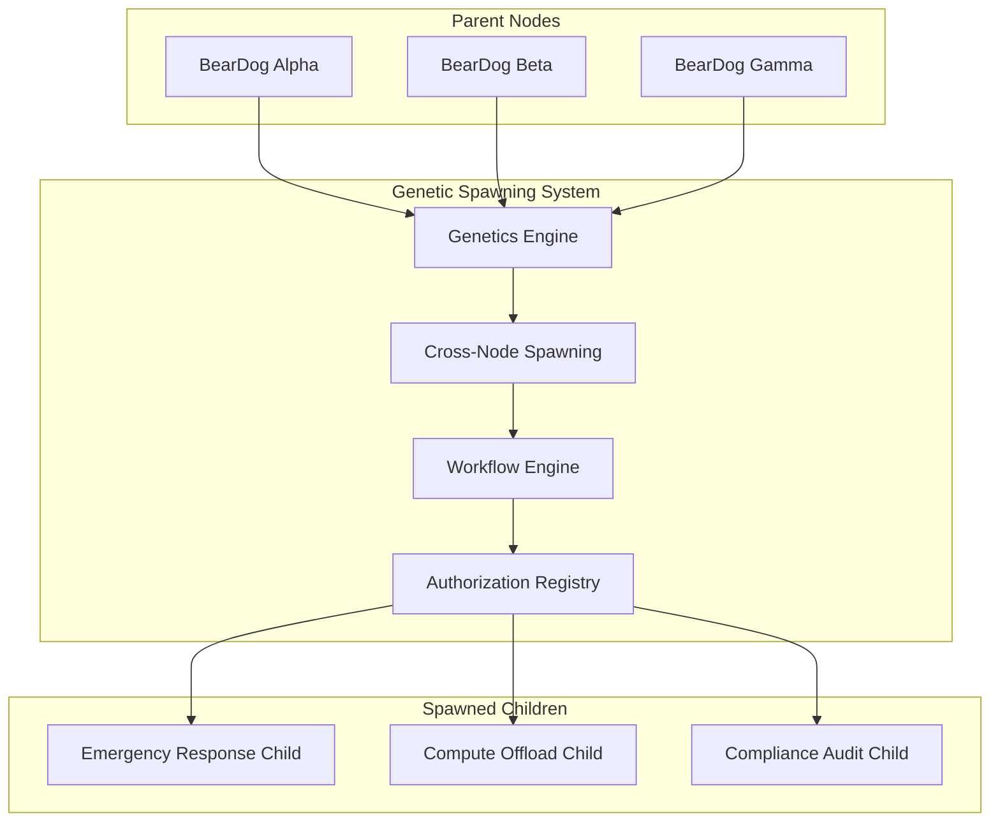

# BearDog Genetic Spawning System Specification

**Version**: 1.0  
**Date**: 2024-12-19  
**Status**: Implemented  

## Executive Summary

The BearDog Genetic Spawning System enables BearDog nodes to "reproduce" by combining their cryptographic genetics to spawn new specialized instances. This revolutionary approach treats security infrastructure as a living, evolving ecosystem that adapts to threats, scales with demand, and improves through genetic algorithms.

## 1. System Architecture

### 1.1 Core Components



### 1.2 Genetic Data Structures

#### BearDogGenetics
- **Genome ID**: Unique cryptographic identifier
- **Crypto Chromosomes**: Algorithm families and key material hashes
- **Capability Genes**: Functional abilities (storage, compute, security)
- **Security Traits**: Behavioral characteristics (paranoia, cooperation, etc.)
- **Lineage**: Parent nodes and generation number
- **Reproductive Rights**: Spawning permissions and restrictions

#### CryptoChromosome
- **Algorithm Family**: Encryption, Signing, Hashing, KDF, ZK-proofs
- **Capability Flags**: Bit-encoded permissions and features
- **Dominance Weight**: Expression strength in offspring (0.0-1.0)
- **Mutation Rate**: Probability of genetic changes

#### CapabilityGene
- **Node Capability**: Specific functional ability
- **Expression Level**: How strongly the capability manifests
- **Inheritance Chain**: Parent node that contributed the gene
- **Mutation History**: Record of all genetic changes

## 2. Genetic Algorithm Design

### 2.1 Reproductive Process

```rust
// Spawning workflow
1. Parent Node(s) identify need for specialized capability
2. Generate SpawnRequest with purpose and resource requirements
3. Route to appropriate workflow (automated/human/hybrid approval)
4. Perform genetic recombination between parent genetics
5. Apply directed evolution based on spawn purpose
6. Generate child genetics with inheritance and mutations
7. Initialize child BearDog with derived cryptographic material
8. Register lineage and establish parent-child relationships
```

### 2.2 Genetic Recombination Rules

#### Chromosome Inheritance
- **Dominant Selection**: Highest dominance weight wins
- **Capability Merging**: Combine flags using bitwise OR
- **Weight Averaging**: Blend dominance across parents
- **Mutation Application**: Random genetic improvements

#### Trait Blending
- **Weighted Average**: Combine parent traits proportionally
- **Blending Factor**: Configurable inheritance strength (default: 0.6)
- **Mutation Chance**: 2x base rate for behavioral traits
- **Bounds Checking**: Ensure all traits remain in [0.0, 1.0] range

#### Capability Evolution
- **Expression Inheritance**: Weighted average of parent expression levels
- **Inheritance Weight**: Default 0.8 to preserve parent capabilities
- **Mutation Probability**: Base 5% chance for genetic improvement
- **Purpose Specialization**: Task-specific enhancements

### 2.3 Directed Evolution

Spawn purpose drives genetic optimization:

- **Emergency Response**: +20% threat sensitivity, +10% innovation rate
- **Compliance Audit**: +15% compliance strictness, +10% paranoia level  
- **Compute Offload**: +20% resource sharing, +10% cooperation tendency
- **Data Migration**: Enhanced storage capabilities and encryption strength

## 3. Multi-Party Workflow Integration

### 3.1 Workflow Types

#### Automated Consensus
```rust
BearDogWorkflowType::AutomatedConsensus {
    participating_nodes: Vec<String>,
    consensus_threshold: f64,        // 0.0-1.0
    max_decision_time: Duration,     // Timeout for consensus
}
```

**Security Model**: 
- Cryptographic voting between trusted nodes
- Consensus threshold prevents rogue spawning
- Time limits prevent indefinite blocking
- All decisions cryptographically auditable

#### Human Approval Required
```rust
BearDogWorkflowType::HumanApprovalRequired {
    approver_roles: Vec<String>,     // security_officer, compliance_lead
    min_approvals: u32,              // Multi-person approval
    approval_timeout: Duration,      // Human response deadline
}
```

**Security Model**:
- Role-based access control for spawning decisions
- Multi-person authorization for high-impact spawns
- Timeout prevents indefinite pending states
- Digital signatures for audit trails

#### Hybrid Approval
```rust
BearDogWorkflowType::HybridApproval {
    automated_checks: Vec<AutomatedCheck>,
    human_oversight: bool,
    escalation_conditions: Vec<EscalationCondition>,
}
```

**Security Model**:
- Automated pre-screening for common scenarios
- Human escalation for edge cases and high-risk operations
- Configurable escalation triggers
- Best of both worlds: efficiency + oversight

### 3.2 Automated Security Checks

```rust
AutomatedCheck::TrustScore { min_score: 0.8 }
AutomatedCheck::ResourceAvailability { min_resources: ResourceLimits }
AutomatedCheck::ComplianceValidation { required_standards: ["SOX", "GDPR"] }
AutomatedCheck::ThreatAssessment { max_risk_level: 0.7 }
AutomatedCheck::GeographicCompliance { allowed_jurisdictions: ["US", "EU"] }
AutomatedCheck::TemporalWindow { allowed_hours: [9, 10, 11, ..., 17] }
```

## 4. Security Model

### 4.1 Safe by Default Principles

#### Genetic Restrictions
- **Spawning Capability**: Not all nodes can reproduce
- **Offspring Limits**: Maximum children per parent (default: 10-50)
- **Resource Bounds**: CPU, memory, storage, network limits
- **Geographic Restrictions**: Jurisdiction-based spawning limits
- **Temporal Windows**: Time-based spawning permissions
- **Purpose Restrictions**: Task-specific spawning only

#### Cryptographic Lineage
- **Parent Verification**: All children cryptographically linked to parents
- **Genetic Signatures**: Tamper-evident genetic records
- **Authorization Inheritance**: Children inherit subset of parent permissions
- **Audit Trails**: Complete genealogical history
- **Revocation Cascades**: Parent revocation affects all descendants

#### Defense in Depth
- **Multi-Party Approval**: Prevent single-point-of-failure spawning
- **Consensus Thresholds**: Require agreement from multiple nodes
- **Human Oversight**: Critical operations escalate to humans
- **Resource Monitoring**: Prevent resource exhaustion attacks
- **Genetic Diversity**: Prevent monoculture vulnerabilities

### 4.2 Threat Model

#### Adversary Capabilities
- **Node Compromise**: Attacker gains control of parent node
- **Genetic Manipulation**: Attempts to modify genetic records
- **Spawning Abuse**: Resource exhaustion through excessive spawning
- **Authorization Bypass**: Attempts to spawn without proper permissions
- **Lineage Forgery**: Creating fake parent-child relationships

#### Mitigations
- **Cryptographic Binding**: All genetics cryptographically signed
- **Consensus Requirements**: Multi-node agreement for spawning
- **Resource Limits**: Hard caps on spawning resources
- **Audit Logging**: Immutable spawning history
- **Revocation Systems**: Ability to terminate rogue spawns

### 4.3 Zero-Trust Spawning

Every spawn operation requires:
1. **Parent Authentication**: Cryptographic proof of parent identity
2. **Authorization Verification**: Proof of spawning permissions
3. **Resource Validation**: Availability of required resources  
4. **Compliance Checking**: Adherence to regulatory requirements
5. **Consensus Achievement**: Agreement from required parties
6. **Genetic Validation**: Legitimate genetic recombination
7. **Audit Logging**: Immutable record of spawn decision

## 5. Operational Procedures

### 5.1 Spawn Lifecycle Management

#### Initialization Phase
1. **Genetic Derivation**: Generate child genetics from parents
2. **Cryptographic Setup**: Derive keys from genetic material
3. **Resource Allocation**: Reserve CPU, memory, storage, network
4. **Service Initialization**: Start required BearDog services
5. **Registry Registration**: Add child to node registry
6. **Parent Binding**: Establish secure parent-child channels

#### Operational Phase
1. **Task Execution**: Perform specialized function
2. **Health Monitoring**: Continuous operational oversight
3. **Performance Metrics**: Resource usage and efficiency tracking
4. **Security Monitoring**: Threat detection and response
5. **Genetic Expression**: Monitor capability gene expression
6. **Mutation Detection**: Identify beneficial/harmful changes

#### Termination Phase
1. **Task Completion**: Finish assigned work
2. **Data Preservation**: Secure important operational data
3. **Resource Cleanup**: Release allocated resources
4. **Audit Finalization**: Complete operational audit trail
5. **Lineage Update**: Mark child as terminated in genetic records
6. **Secure Destruction**: Cryptographically wipe child instance

### 5.2 Genetic Health Management

#### Mutation Monitoring
- **Beneficial Mutations**: Preserve and potentially propagate
- **Neutral Mutations**: Monitor for emergent effects
- **Harmful Mutations**: Quarantine and prevent propagation
- **Reversion Capability**: Ability to revert to parent genetics

#### Diversity Maintenance
- **Genetic Distance**: Prevent excessive inbreeding
- **Population Genetics**: Maintain healthy diversity in node population
- **Selection Pressure**: Environmental factors influencing evolution
- **Founder Effects**: Manage genetic bottlenecks

#### Lineage Integrity
- **Genealogical Verification**: Cryptographic proof of ancestry
- **Genetic Consistency**: Validate genetic records against blockchain
- **Orphan Detection**: Identify nodes with invalid lineage
- **Reconciliation Procedures**: Resolve genetic inconsistencies

## 6. Implementation Requirements

### 6.1 Core APIs

```rust
// Genetics Engine
trait BearDogGeneticsEngine {
    async fn get_node_genetics(&self, node_id: &str) -> BearDogResult<BearDogGenetics>;
    async fn recombine_genetics(&self, parents: &[String], purpose: &SpawnPurpose) -> BearDogResult<BearDogGenetics>;
    async fn mutate_capabilities(&self, genetics: &BearDogGenetics, rate: f64) -> BearDogResult<BearDogGenetics>;
    async fn validate_lineage(&self, genetics: &BearDogGenetics) -> BearDogResult<bool>;
}

// Cross-Node Spawning
trait CrossNodeSpawning {
    async fn request_spawn_permission(&self, request: SpawnRequest) -> BearDogResult<String>;
    async fn execute_spawn(&self, request: SpawnRequest, genetics: BearDogGenetics) -> BearDogResult<SpawnedBearDog>;
    async fn terminate_spawn(&self, child_id: &str) -> BearDogResult<()>;
    async fn list_children(&self) -> BearDogResult<Vec<SpawnedBearDog>>;
}

// Genetic Storage
trait GeneticsStore {
    async fn store_genetics(&self, node_id: &str, genetics: &BearDogGenetics) -> BearDogResult<()>;
    async fn load_genetics(&self, node_id: &str) -> BearDogResult<Option<BearDogGenetics>>;
    async fn store_lineage(&self, lineage: &GeneticLineage) -> BearDogResult<()>;
    async fn get_descendants(&self, parent_id: &str) -> BearDogResult<Vec<String>>;
}
```

### 6.2 Configuration Parameters

```rust
struct GeneticsConfig {
    base_mutation_rate: f64,           // Default: 0.05 (5%)
    max_genetic_diversity: f64,        // Default: 0.8
    min_security_threshold: f64,       // Default: 0.7
    capability_inheritance_weight: f64, // Default: 0.8
    trait_blending_factor: f64,        // Default: 0.6
    enable_directed_evolution: bool,   // Default: true
    max_generations: u32,              // Default: 10
    genetic_diversity_requirement: f64, // Default: 0.3
}

struct SpawningLimits {
    max_children_per_parent: u32,      // Default: 20
    max_total_spawns_per_hour: u32,    // Default: 100
    max_resource_allocation_percent: f64, // Default: 0.8
    min_consensus_nodes: u32,          // Default: 3
    spawn_approval_timeout: Duration,  // Default: 1 hour
}
```

## 7. Testing and Validation

### 7.1 Unit Testing Requirements

#### Genetic Algorithm Testing
- **Deterministic Reproduction**: Same inputs produce same genetics
- **Trait Inheritance**: Verify weighted averaging of parent traits
- **Mutation Boundaries**: Ensure mutations stay within valid ranges
- **Diversity Metrics**: Measure genetic diversity in populations
- **Convergence Testing**: Verify directed evolution effectiveness

#### Security Testing
- **Authorization Verification**: Only authorized spawning succeeds
- **Resource Limit Enforcement**: Spawns respect resource boundaries
- **Consensus Requirement**: Multi-party approval works correctly
- **Audit Trail Integrity**: All spawning decisions properly logged
- **Cryptographic Binding**: Parent-child relationships are verifiable

### 7.2 Integration Testing

#### Cross-Node Communication
- **Consensus Protocol**: Multi-node spawning agreement
- **Genetic Exchange**: Transfer genetics between nodes
- **Authorization Propagation**: Child permissions from parents
- **Network Partitions**: Behavior during network splits
- **Byzantine Failures**: Handling of malicious nodes

#### Workflow Integration
- **Human Approval Flows**: End-to-end approval workflows
- **Automated Decision Making**: Consensus without human intervention
- **Escalation Procedures**: Automatic escalation to humans
- **Timeout Handling**: Proper cleanup of expired workflows
- **Error Recovery**: Graceful handling of workflow failures

### 7.3 End-to-End Testing

#### Spawn Lifecycle
- **Complete Reproduction**: Full parent-to-child spawning
- **Task Specialization**: Verify purpose-specific capabilities
- **Resource Management**: Proper allocation and cleanup
- **Termination Procedures**: Graceful child node shutdown
- **Audit Completeness**: End-to-end audit trail validation

#### Genetic Evolution
- **Multi-Generation Spawning**: Children spawning grandchildren
- **Genetic Drift**: Population genetics over time
- **Beneficial Mutations**: Preservation of improvements
- **Lineage Tracking**: Complete genealogical records
- **Population Health**: Genetic diversity maintenance

## 8. Chaos Engineering for Genetic Security

### 8.1 Genetic Chaos Testing

#### Mutation Stress Tests
- **High Mutation Rates**: Test system behavior with 50%+ mutation rates
- **Beneficial Mutation Floods**: Overwhelm system with positive mutations
- **Harmful Mutation Injection**: Introduce known bad genetic changes
- **Genetic Corruption**: Simulate corrupted genetic data
- **Reversion Cascades**: Force genetic reversions across populations

#### Reproductive Chaos
- **Spawning Storms**: Trigger massive simultaneous spawning
- **Resource Exhaustion**: Spawn until resources depleted
- **Consensus Failures**: Simulate consensus mechanism breakdowns
- **Authorization Revocation**: Randomly revoke spawning permissions
- **Parent Node Failures**: Kill parent nodes with active children

#### Lineage Chaos
- **Genealogy Corruption**: Corrupt lineage records
- **Orphan Creation**: Create nodes with invalid parentage
- **Genetic Inconsistency**: Introduce conflicting genetic records
- **Time Travel Attacks**: Attempt to modify historical genetics
- **Identity Confusion**: Mix up node genetic identities

### 8.2 Security Chaos Scenarios

#### Byzantine Genetic Attacks
- **Malicious Parent Nodes**: Compromise spawning nodes
- **Genetic Pollution**: Introduce harmful genetic material
- **Consensus Manipulation**: Attempt to control spawning decisions
- **Resource Monopolization**: Prevent legitimate spawning
- **Audit Trail Manipulation**: Corrupt spawning history

#### Network Partition Chaos
- **Split-Brain Spawning**: Different partitions spawn conflicting children
- **Consensus Partitions**: Break consensus mechanisms
- **Genetic Synchronization**: Test genetic record consistency
- **Reunification Challenges**: Merge conflicting genetic states
- **Byzantine Partition Tolerance**: Handle malicious partitions

### 8.3 Chaos Metrics and Validation

#### System Resilience Metrics
- **Spawning Success Rate**: % of legitimate spawns that succeed
- **Genetic Integrity Score**: Genetic record accuracy and consistency  
- **Consensus Effectiveness**: Multi-party agreement success rate
- **Resource Utilization**: Efficiency of resource allocation
- **Security Breach Prevention**: % of attacks successfully blocked

#### Recovery Metrics
- **Mean Time to Detection**: How quickly anomalies are identified
- **Mean Time to Containment**: Speed of threat isolation
- **Mean Time to Recovery**: System restoration time
- **Genetic Rollback Success**: Ability to revert harmful changes
- **Population Health Recovery**: Restoration of genetic diversity

## 9. Compliance and Governance

### 9.1 Regulatory Compliance

#### Data Protection (GDPR, CCPA)
- **Genetic Data Privacy**: Treat genetics as personal data
- **Right to Deletion**: Ability to remove genetic records
- **Data Portability**: Export genetic data in standard formats
- **Consent Management**: User consent for genetic operations
- **Cross-Border Transfers**: International genetic data movement

#### Financial Services (SOX, PCI-DSS)
- **Audit Trail Requirements**: Complete spawning history
- **Control Documentation**: Genetic governance procedures
- **Change Management**: Controlled genetic modifications
- **Access Controls**: Role-based genetic operations
- **Incident Response**: Genetic security breach procedures

### 9.2 Ethical Considerations

#### Genetic Rights
- **Node Autonomy**: Right to control own genetic information
- **Reproductive Freedom**: Right to spawn or not spawn
- **Genetic Privacy**: Protection of genetic characteristics
- **Non-Discrimination**: Equal treatment regardless of genetics
- **Genetic Enhancement**: Ethical limits on genetic modification

#### Population Genetics
- **Diversity Preservation**: Maintain genetic heterogeneity
- **Eugenics Prevention**: Avoid selective genetic breeding
- **Genetic Justice**: Fair distribution of genetic advantages
- **Future Generations**: Responsibility to genetic descendants
- **Environmental Impact**: Genetic adaptation effects

## 10. Metrics and Monitoring

### 10.1 Genetic Health Metrics

```rust
struct GeneticHealthMetrics {
    population_size: u32,
    genetic_diversity_index: f64,
    average_generation: f64,
    mutation_rate_actual: f64,
    beneficial_mutation_ratio: f64,
    lineage_integrity_score: f64,
    spawning_success_rate: f64,
    consensus_effectiveness: f64,
}
```

### 10.2 Operational Metrics

```rust
struct SpawningMetrics {
    spawns_per_hour: u32,
    resource_utilization: f64,
    average_spawn_duration: Duration,
    approval_time_p99: Duration,
    consensus_time_p99: Duration,
    genetic_recombination_time: Duration,
    child_initialization_time: Duration,
    spawning_error_rate: f64,
}
```

### 10.3 Security Metrics

```rust
struct GeneticSecurityMetrics {
    unauthorized_spawn_attempts: u32,
    consensus_attacks_blocked: u32,
    genetic_tampering_detected: u32,
    resource_exhaustion_prevented: u32,
    audit_trail_integrity_score: f64,
    cryptographic_verification_success_rate: f64,
    byzantine_node_detection_rate: f64,
}
```

## 11. Future Enhancements

### 11.1 Advanced Genetic Features

#### Horizontal Gene Transfer
- **Cross-Population Exchange**: Genetic material between unrelated nodes
- **Viral Genetics**: Beneficial genes that spread through populations
- **Genetic Libraries**: Shared repositories of useful genetic material
- **Gene Therapy**: Targeted genetic modifications for specific issues

#### Epigenetic Control
- **Environmental Expression**: Gene expression based on environment
- **Adaptive Regulation**: Dynamic capability adjustment
- **Stress Response**: Genetic adaptation to hostile conditions
- **Memory Formation**: Genetic encoding of learned behaviors

#### Population Dynamics
- **Genetic Algorithms**: Population-level optimization
- **Competitive Evolution**: Resource-based natural selection
- **Symbiotic Relationships**: Mutually beneficial genetic partnerships
- **Ecosystem Engineering**: Environment modification through genetics

### 11.2 Integration Enhancements

#### Blockchain Genetics
- **Immutable Lineage**: Blockchain-based genetic records
- **Smart Contract Spawning**: Automated spawning through contracts
- **Genetic Tokens**: Tradeable genetic capabilities
- **Decentralized Genetics**: Distributed genetic governance

#### AI-Driven Evolution
- **Machine Learning Genetics**: AI-optimized genetic algorithms
- **Predictive Evolution**: Forecast optimal genetic changes
- **Automated Discovery**: AI discovery of beneficial mutations
- **Genetic Optimization**: ML-driven genetic improvement

## 12. Conclusion

The BearDog Genetic Spawning System represents a paradigm shift from static security infrastructure to living, evolving ecosystems. By combining cryptographic security with genetic algorithms, we create systems that:

- **Adapt** to new threats through genetic evolution
- **Scale** elastically through reproductive spawning  
- **Improve** continuously through beneficial mutations
- **Maintain Security** through cryptographic lineage verification
- **Enable Zero-Touch Operations** while preserving human oversight
- **Preserve Audit Trails** through immutable genetic records

This system enables the vision of truly autonomous security infrastructure that can grow, adapt, and evolve while maintaining the highest standards of security, compliance, and governance.

---

**Document Classification**: Internal Technical Specification  
**Next Review Date**: 2025-01-19  
**Approval Required**: Architecture Review Board, Security Team, Compliance Team 