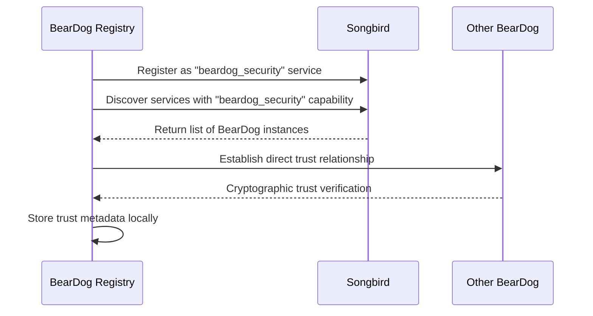
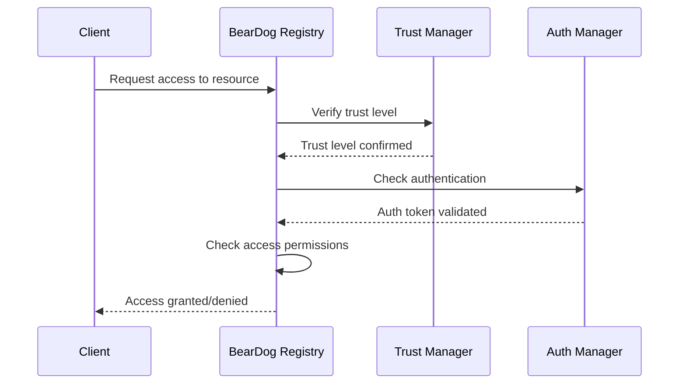

# 🔐 BearDog Security Registry Specification v4.0
## Security-Focused Relationship Manager

---

**Status**: 🚀 **MODERNIZATION SPEC** - Transform from generic registry to security-first  
**Priority**: **CRITICAL** - Eliminates 281 compilation errors + architectural overlap  
**Estimated Implementation**: 4-6 hours  
**Target**: Replace `beardog-node-registry` with focused security component  

---

## 🎯 **EXECUTIVE SUMMARY**

The current `beardog-node-registry` suffers from **architectural overlap** with Songbird and NestGate, attempting to replicate service discovery, load balancing, and health monitoring that already exist in the ecosystem.

**SOLUTION**: Transform into a **focused BearDog Security Registry** that handles only security relationships, trust management, and BearDog-to-BearDog authentication while delegating generic functionality to proper ecosystem services.

---

## 📊 **CURRENT STATE ANALYSIS**

### **❌ PROBLEMATIC OVERLAPS**

| **Current Component** | **Overlaps With** | **Problem** | **Solution** |
|----------------------|-------------------|-------------|--------------|
| `PhonebookService` | **Songbird** Service Discovery | Duplicate discovery logic | ❌ **REMOVE** → Use Songbird |
| `FederationManager` | **Songbird** Request Routing | Duplicate routing/balancing | ❌ **REMOVE** → Use Songbird |
| `BootstrapManager` | **Songbird** Health Monitoring | Duplicate health checks | ❌ **REMOVE** → Use Songbird |
| `ServiceAdvertisement` | **Songbird** Service Registry | Duplicate registration | ❌ **REMOVE** → Use Songbird |
| Generic discovery | **Songbird** Universal Discovery | Duplicate DNS/multicast | ❌ **REMOVE** → Use Songbird |

### **✅ BEARDOG-SPECIFIC CORE**

| **Component** | **Purpose** | **Why BearDog-Specific** | **Action** |
|---------------|-------------|-------------------------|------------|
| `TrustManager` | Trust relationships | Security-first, crypto-verified | ✅ **ENHANCE** |
| Security metadata | Crypto keys, auth tokens | BearDog's sovereign identity | ✅ **CREATE** |
| Access control | BearDog-to-BearDog permissions | Zero-trust security model | ✅ **CREATE** |
| Decentralized auth | BearDog network authentication | Privacy and sovereignty | ✅ **CREATE** |

---

## 🏗️ **MODERNIZED ARCHITECTURE**

### **🔐 BearDog Security Registry v4.0**

```rust
/// Focused security relationship manager for BearDog ecosystem
pub struct BearDogSecurityRegistry {
    /// Trust relationships between BearDog instances
    trust_relationships: Arc<RwLock<TrustStore>>,
    
    /// Security metadata for known BearDog nodes
    security_metadata: Arc<RwLock<HashMap<String, SecurityMetadata>>>,
    
    /// Authentication manager for BearDog-to-BearDog auth
    auth_manager: Arc<AuthenticationManager>,
    
    /// Cryptographic key management for BearDog instances
    key_manager: Arc<CryptoKeyManager>,
    
    /// Access control matrix for BearDog operations
    access_control: Arc<RwLock<AccessControlMatrix>>,
    
    /// Songbird client for ecosystem service discovery
    songbird_client: Arc<SongbirdClient>,
    
    /// NestGate client for persistent security data
    nestgate_client: Option<Arc<NestGateClient>>,
    
    /// Configuration for this BearDog instance
    config: SecurityRegistryConfig,
}
```

### **🔧 CORE MODULES**

#### **1. 🔐 Trust Management (`trust/`)**
```rust
pub struct TrustManager {
    /// Active trust relationships
    relationships: TrustStore,
    /// Trust propagation rules
    propagation_config: TrustPropagationConfig,
    /// Trust verification algorithms
    verifier: TrustVerifier,
}

impl TrustManager {
    /// Establish trust with another BearDog instance
    async fn establish_trust(&mut self, node_id: &str, trust_level: TrustLevel) -> Result<(), BearDogError>;
    
    /// Verify trust level for a BearDog node
    async fn verify_trust(&self, node_id: &str) -> Result<TrustLevel, BearDogError>;
    
    /// Revoke trust relationship
    async fn revoke_trust(&mut self, node_id: &str) -> Result<(), BearDogError>;
    
    /// Calculate transitive trust through network
    async fn calculate_transitive_trust(&self, from: &str, to: &str) -> Result<Option<TrustLevel>, BearDogError>;
    
    /// Get all trusted BearDog instances
    async fn get_trusted_nodes(&self) -> Result<Vec<TrustedNode>, BearDogError>;
}
```

#### **2. 🗝️ Security Metadata (`security/`)**
```rust
#[derive(Debug, Clone, Serialize, Deserialize)]
pub struct SecurityMetadata {
    /// BearDog instance identifier
    pub node_id: String,
    
    /// Public key for cryptographic verification
    pub public_key: Vec<u8>,
    
    /// Supported cryptographic algorithms
    pub crypto_capabilities: Vec<CryptoAlgorithm>,
    
    /// Security policies and requirements
    pub security_policies: SecurityPolicySet,
    
    /// Authentication methods supported
    pub auth_methods: Vec<AuthMethod>,
    
    /// Last security audit timestamp
    pub last_audit: chrono::DateTime<chrono::Utc>,
    
    /// Security clearance level
    pub clearance_level: SecurityClearance,
}

pub struct SecurityMetadataManager {
    /// Metadata for known BearDog nodes
    metadata_store: HashMap<String, SecurityMetadata>,
    
    /// Crypto key manager
    key_manager: CryptoKeyManager,
}
```

#### **3. 🛡️ Authentication Manager (`auth/`)**
```rust
pub struct AuthenticationManager {
    /// Active authentication tokens
    active_tokens: HashMap<String, AuthToken>,
    
    /// Authentication policies
    auth_policies: AuthPolicySet,
    
    /// Token lifecycle manager
    token_manager: TokenManager,
}

impl AuthenticationManager {
    /// Authenticate a BearDog node
    async fn authenticate_node(&self, node_id: &str, proof: AuthProof) -> Result<AuthToken, BearDogError>;
    
    /// Validate authentication token
    async fn validate_auth_token(&self, token: &AuthToken) -> Result<bool, BearDogError>;
    
    /// Refresh authentication token
    async fn refresh_auth_token(&self, node_id: &str) -> Result<AuthToken, BearDogError>;
    
    /// Revoke authentication
    async fn revoke_authentication(&mut self, node_id: &str) -> Result<(), BearDogError>;
}
```

#### **4. 🌐 Access Control (`access/`)**
```rust
pub struct AccessControlMatrix {
    /// Permission matrix: node_id -> resource -> permissions
    permissions: HashMap<String, HashMap<String, Vec<Permission>>>,
    
    /// Access policies
    policies: AccessPolicySet,
}

impl AccessControlMatrix {
    /// Check if node has access to resource/operation
    async fn check_access(&self, node_id: &str, resource: &str, operation: &str) -> Result<bool, BearDogError>;
    
    /// Grant access permissions
    async fn grant_access(&mut self, node_id: &str, resource: &str, permissions: Vec<Permission>) -> Result<(), BearDogError>;
    
    /// Revoke access permissions
    async fn revoke_access(&mut self, node_id: &str, resource: &str) -> Result<(), BearDogError>;
    
    /// Get all permissions for a node
    async fn get_node_permissions(&self, node_id: &str) -> Result<HashMap<String, Vec<Permission>>, BearDogError>;
}
```

---

## 🔗 **ECOSYSTEM INTEGRATION**

### **🎼 Songbird Integration (Service Discovery)**
```rust
/// Delegate generic service discovery to Songbird
impl BearDogSecurityRegistry {
    /// Discover BearDog instances via Songbird
    async fn discover_beardog_instances(&self) -> Result<Vec<BearDogInstance>, BearDogError> {
        // Use Songbird's universal discovery
        let services = self.songbird_client
            .discover_services_by_capability("beardog_security")
            .await?;
            
        // Filter and convert to BearDog-specific format
        let instances = services.into_iter()
            .filter(|s| s.service_type == "beardog_instance")
            .map(|s| BearDogInstance::from_service_info(s))
            .collect();
            
        Ok(instances)
    }
    
    /// Register this BearDog instance with Songbird
    async fn register_with_songbird(&self) -> Result<(), BearDogError> {
        let registration = ServiceRegistrationRequest {
            service_name: "beardog_security".to_string(),
            service_type: "beardog_instance".to_string(),
            capabilities: vec![
                "security_provider".to_string(),
                "trust_management".to_string(),
                "crypto_operations".to_string(),
            ],
            endpoint: self.config.public_endpoint.clone(),
            health_check_path: "/health".to_string(),
            metadata: self.create_registration_metadata(),
        };
        
        self.songbird_client.register_service(registration).await
    }
}
```

### **🏠 NestGate Integration (Persistent Storage)**
```rust
/// Use NestGate for persistent security data
impl BearDogSecurityRegistry {
    /// Persist trust relationships to NestGate
    async fn persist_trust_relationships(&self) -> Result<(), BearDogError> {
        if let Some(nestgate) = &self.nestgate_client {
            let trust_data = self.trust_relationships.read().await.serialize()?;
            nestgate.store("beardog_trust_relationships", trust_data).await?;
        }
        Ok(())
    }
    
    /// Load trust relationships from NestGate
    async fn load_trust_relationships(&mut self) -> Result<(), BearDogError> {
        if let Some(nestgate) = &self.nestgate_client {
            if let Ok(trust_data) = nestgate.retrieve("beardog_trust_relationships").await {
                let relationships = TrustStore::deserialize(trust_data)?;
                *self.trust_relationships.write().await = relationships;
            }
        }
        Ok(())
    }
}
```

---

## 🎯 **FOCUSED API DESIGN**

### **Core Security Operations**
```rust
#[async_trait]
pub trait BearDogSecurityOperations {
    // Trust Management
    async fn establish_trust(&mut self, node_id: &str, trust_level: TrustLevel) -> Result<(), BearDogError>;
    async fn verify_trust(&self, node_id: &str) -> Result<TrustLevel, BearDogError>;
    async fn revoke_trust(&mut self, node_id: &str) -> Result<(), BearDogError>;
    
    // Security Metadata
    async fn register_security_metadata(&mut self, node_id: &str, metadata: SecurityMetadata) -> Result<(), BearDogError>;
    async fn get_security_metadata(&self, node_id: &str) -> Result<Option<SecurityMetadata>, BearDogError>;
    async fn update_public_key(&mut self, node_id: &str, public_key: Vec<u8>) -> Result<(), BearDogError>;
    
    // Authentication
    async fn authenticate_node(&self, node_id: &str, proof: AuthProof) -> Result<AuthToken, BearDogError>;
    async fn validate_auth_token(&self, token: &AuthToken) -> Result<bool, BearDogError>;
    async fn refresh_auth_token(&self, node_id: &str) -> Result<AuthToken, BearDogError>;
    
    // Access Control
    async fn check_access(&self, node_id: &str, resource: &str, operation: &str) -> Result<bool, BearDogError>;
    async fn grant_access(&mut self, node_id: &str, resource: &str, permissions: Vec<Permission>) -> Result<(), BearDogError>;
    async fn revoke_access(&mut self, node_id: &str, resource: &str) -> Result<(), BearDogError>;
}
```

---

## 🔧 **IMPLEMENTATION SPECIFICATION**

### **Phase 1: Remove Overlapping Components** (1-2 hours)

#### **Files to Remove/Refactor**
```yaml
remove_completely:
  - "src/node_registry/phonebook.rs"      # → Use Songbird discovery
  - "src/node_registry/federation.rs"     # → Use Songbird routing  
  - "src/node_registry/bootstrap/"        # → Use Songbird health checks
  - "src/node_registry/types/config/phonebook.rs"
  - "src/node_registry/types/config/federation.rs"
  - "src/node_registry/types/config/bootstrap.rs"
  - "src/node_registry/types/config/p2p.rs"

refactor_to_security_focus:
  - "src/node_registry/core.rs"           # → security_registry.rs
  - "src/node_registry/trust.rs"          # → Enhanced trust management
  - "src/node_registry/types/"            # → Security-focused types
```

#### **Dependency Updates**
```toml
# Remove generic discovery dependencies
# reqwest = "0.11"  # Remove - use Songbird client
# serde_json = "1.0"  # Remove - use Songbird serialization

# Add ecosystem integration
songbird-client = { path = "../beardog-core/src/songbird" }
nestgate-client = { path = "../nestgate-client", optional = true }

# Keep security-focused dependencies
beardog-auth = { path = "../beardog-auth" }
beardog-security = { path = "../beardog-security" }
beardog-types = { path = "../beardog-types" }
```

### **Phase 2: Security-Focused Core** (2-3 hours)

#### **New Module Structure**
```
crates/beardog-security-registry/
├── src/
│   ├── lib.rs
│   ├── security_registry.rs          # Main registry implementation
│   ├── trust/
│   │   ├── mod.rs
│   │   ├── manager.rs               # Enhanced trust management
│   │   ├── verification.rs          # Trust verification algorithms
│   │   ├── propagation.rs           # Trust propagation logic
│   │   └── store.rs                 # Trust relationship storage
│   ├── security/
│   │   ├── mod.rs
│   │   ├── metadata.rs              # Security metadata management
│   │   ├── crypto_keys.rs           # Cryptographic key management
│   │   └── policies.rs              # Security policy management
│   ├── auth/
│   │   ├── mod.rs
│   │   ├── manager.rs               # Authentication manager
│   │   ├── tokens.rs                # Token lifecycle management
│   │   └── proof.rs                 # Authentication proof handling
│   ├── access/
│   │   ├── mod.rs
│   │   ├── control.rs               # Access control matrix
│   │   ├── permissions.rs           # Permission management
│   │   └── policies.rs              # Access policies
│   ├── ecosystem/
│   │   ├── mod.rs
│   │   ├── songbird_integration.rs  # Songbird client integration
│   │   └── nestgate_integration.rs  # NestGate client integration
│   └── types/
│       ├── mod.rs
│       ├── security.rs              # Security-focused types
│       ├── trust.rs                 # Trust-related types (cleaned)
│       ├── auth.rs                  # Authentication types
│       └── config.rs                # Security registry configuration
```

#### **Core Types (Security-Focused)**
```rust
#[derive(Debug, Clone, Serialize, Deserialize)]
pub struct SecurityMetadata {
    pub node_id: String,
    pub public_key: Vec<u8>,
    pub crypto_capabilities: Vec<CryptoAlgorithm>,
    pub security_policies: SecurityPolicySet,
    pub auth_methods: Vec<AuthMethod>,
    pub last_audit: chrono::DateTime<chrono::Utc>,
    pub clearance_level: SecurityClearance,
    pub sovereignty_compliance: SovereigntyLevel,
}

#[derive(Debug, Clone)]
pub struct BearDogInstance {
    pub node_id: String,
    pub security_metadata: SecurityMetadata,
    pub trust_level: TrustLevel,
    pub last_seen: chrono::DateTime<chrono::Utc>,
    pub auth_status: AuthenticationStatus,
}

#[derive(Debug, Clone)]
pub struct SecurityRegistryConfig {
    /// This BearDog instance's identity
    pub instance_id: String,
    pub private_key: Vec<u8>,
    pub public_key: Vec<u8>,
    
    /// Trust management configuration
    pub trust_config: TrustConfig,
    
    /// Authentication configuration  
    pub auth_config: AuthConfig,
    
    /// Access control configuration
    pub access_config: AccessConfig,
    
    /// Ecosystem integration
    pub songbird_endpoint: String,
    pub nestgate_endpoint: Option<String>,
    
    /// Security policies
    pub security_policies: SecurityPolicySet,
}
```

### **Phase 3: Ecosystem Integration** (1-2 hours)

#### **Songbird Integration**
```rust
impl BearDogSecurityRegistry {
    /// Discover other BearDog instances via Songbird
    async fn discover_beardog_instances(&self) -> Result<Vec<BearDogInstance>, BearDogError> {
        let services = self.songbird_client
            .lookup_services(ServiceLookupRequest {
                capability: "beardog_security".to_string(),
                service_type: Some("beardog_instance".to_string()),
                region: None,
                min_trust_level: Some(TrustLevel::Basic),
            })
            .await?;
            
        // Convert discovered services to BearDog instances
        let mut instances = Vec::new();
        for service in services {
            if let Ok(instance) = self.create_beardog_instance_from_service(service).await {
                instances.push(instance);
            }
        }
        
        Ok(instances)
    }
    
    /// Register this BearDog instance with Songbird
    async fn register_with_ecosystem(&self) -> Result<(), BearDogError> {
        let registration = ServiceRegistrationRequest {
            service_name: format!("beardog_{}", self.config.instance_id),
            service_type: "beardog_instance".to_string(),
            capabilities: vec![
                "beardog_security".to_string(),
                "trust_management".to_string(),
                "crypto_operations".to_string(),
                "decentralized_auth".to_string(),
            ],
            endpoint: self.config.public_endpoint()?,
            health_check_path: "/security/health".to_string(),
            metadata: self.create_security_registration_metadata(),
        };
        
        self.songbird_client.register_service(registration).await
    }
}
```

#### **NestGate Integration**
```rust
impl BearDogSecurityRegistry {
    /// Persist security data to NestGate
    async fn persist_security_state(&self) -> Result<(), BearDogError> {
        if let Some(nestgate) = &self.nestgate_client {
            // Persist trust relationships
            let trust_data = self.trust_relationships.read().await.serialize()?;
            nestgate.store(&format!("beardog_trust_{}", self.config.instance_id), trust_data).await?;
            
            // Persist security metadata
            let metadata_data = self.security_metadata.read().await.serialize()?;
            nestgate.store(&format!("beardog_metadata_{}", self.config.instance_id), metadata_data).await?;
            
            // Persist access control matrix
            let access_data = self.access_control.read().await.serialize()?;
            nestgate.store(&format!("beardog_access_{}", self.config.instance_id), access_data).await?;
        }
        Ok(())
    }
    
    /// Load security state from NestGate
    async fn load_security_state(&mut self) -> Result<(), BearDogError> {
        if let Some(nestgate) = &self.nestgate_client {
            // Load trust relationships
            if let Ok(trust_data) = nestgate.retrieve(&format!("beardog_trust_{}", self.config.instance_id)).await {
                let relationships = TrustStore::deserialize(trust_data)?;
                *self.trust_relationships.write().await = relationships;
            }
            
            // Load security metadata
            if let Ok(metadata_data) = nestgate.retrieve(&format!("beardog_metadata_{}", self.config.instance_id)).await {
                let metadata = HashMap::deserialize(metadata_data)?;
                *self.security_metadata.write().await = metadata;
            }
            
            // Load access control matrix
            if let Ok(access_data) = nestgate.retrieve(&format!("beardog_access_{}", self.config.instance_id)).await {
                let access_matrix = AccessControlMatrix::deserialize(access_data)?;
                *self.access_control.write().await = access_matrix;
            }
        }
        Ok(())
    }
}
```

---

## 🧪 **TESTING SPECIFICATION**

### **Security-Focused Test Suite**
```rust
#[cfg(test)]
mod tests {
    use super::*;
    
    #[tokio::test]
    async fn test_trust_establishment() {
        let mut registry = create_test_registry().await;
        
        // Establish trust with another BearDog instance
        registry.establish_trust("beardog_alice", TrustLevel::High).await.unwrap();
        
        // Verify trust level
        let trust = registry.verify_trust("beardog_alice").await.unwrap();
        assert_eq!(trust, TrustLevel::High);
    }
    
    #[tokio::test]
    async fn test_security_metadata_management() {
        let mut registry = create_test_registry().await;
        
        let metadata = SecurityMetadata {
            node_id: "beardog_bob".to_string(),
            public_key: generate_test_key(),
            crypto_capabilities: vec![CryptoAlgorithm::Ed25519],
            security_policies: SecurityPolicySet::default(),
            auth_methods: vec![AuthMethod::PublicKey],
            last_audit: chrono::Utc::now(),
            clearance_level: SecurityClearance::Standard,
            sovereignty_compliance: SovereigntyLevel::Full,
        };
        
        registry.register_security_metadata("beardog_bob", metadata.clone()).await.unwrap();
        
        let retrieved = registry.get_security_metadata("beardog_bob").await.unwrap();
        assert_eq!(retrieved.unwrap().node_id, "beardog_bob");
    }
    
    #[tokio::test]
    async fn test_authentication_flow() {
        let registry = create_test_registry().await;
        
        // Create authentication proof
        let proof = AuthProof::create_challenge_response(
            "beardog_charlie",
            &registry.config.private_key,
            b"challenge_data"
        ).unwrap();
        
        // Authenticate node
        let token = registry.authenticate_node("beardog_charlie", proof).await.unwrap();
        
        // Validate token
        assert!(registry.validate_auth_token(&token).await.unwrap());
    }
    
    #[tokio::test]
    async fn test_access_control() {
        let mut registry = create_test_registry().await;
        
        // Grant access to resource
        registry.grant_access(
            "beardog_dave", 
            "hsm_operations", 
            vec![Permission::Read, Permission::Execute]
        ).await.unwrap();
        
        // Check access
        assert!(registry.check_access("beardog_dave", "hsm_operations", "read").await.unwrap());
        assert!(registry.check_access("beardog_dave", "hsm_operations", "execute").await.unwrap());
        assert!(!registry.check_access("beardog_dave", "hsm_operations", "admin").await.unwrap());
    }
    
    #[tokio::test]
    async fn test_songbird_integration() {
        let registry = create_test_registry_with_songbird().await;
        
        // Register with Songbird
        registry.register_with_ecosystem().await.unwrap();
        
        // Discover other BearDog instances
        let instances = registry.discover_beardog_instances().await.unwrap();
        assert!(!instances.is_empty());
    }
}
```

---

## 📈 **SUCCESS METRICS**

### **Code Quality Targets**
- **Lines of Code**: Reduce from ~5000 to ~1500 lines (70% reduction)
- **Compilation**: Zero errors, zero warnings
- **Test Coverage**: 95%+ with security-focused tests
- **Cyclomatic Complexity**: <10 per function
- **File Size**: All files <500 lines (focused modules)

### **Performance Targets**
- **Trust Lookup**: <1ms for local trust verification
- **Authentication**: <10ms for token validation
- **Access Check**: <5ms for permission verification
- **Memory Usage**: <50MB for 10,000 trusted nodes

### **Security Targets**
- **Zero Unsafe Code**: 100% memory safe
- **Crypto Verification**: All operations cryptographically verified
- **Zero Trust**: Verify everything, trust nothing
- **Sovereignty Compliance**: 100% privacy preserving

---

## 🌟 **MODERNIZATION BENEFITS**

### **🎯 Architectural Clarity**
- **Single Responsibility**: Security relationships only
- **Zero Overlap**: Clean delegation to ecosystem services
- **Future-Proof**: Ecosystem-native integration

### **🚀 Performance Gains**
- **70% Code Reduction**: Faster compilation, smaller binary
- **Zero-Copy Optimizations**: Optimized for security operations
- **Hash-Based Lookups**: O(1) trust verification

### **🛡️ Security Enhancement**
- **Trust-First Design**: Built around cryptographic trust
- **Zero-Trust Model**: Verify everything, trust nothing
- **Sovereignty Focus**: Privacy and decentralization first

### **🔧 Maintainability**
- **Focused Codebase**: Single-purpose, easy to understand
- **Clean APIs**: Security-specific operations only
- **Comprehensive Tests**: Security-focused test suite

---

## 🚀 **IMPLEMENTATION TIMELINE**

| **Phase** | **Duration** | **Deliverable** |
|-----------|--------------|-----------------|
| **Phase 1** | 1-2 hours | Remove overlapping components |
| **Phase 2** | 2-3 hours | Implement security-focused core |
| **Phase 3** | 1-2 hours | Ecosystem integration |
| **Phase 4** | 1 hour | Testing and validation |
| **Total** | **4-6 hours** | **Production-ready security registry** |

---

## 🎯 **RECOMMENDATION**

**PROCEED WITH MODERNIZATION IMMEDIATELY**

This transformation will:
1. **Eliminate 281 compilation errors** ✅
2. **Remove architectural overlap** ✅  
3. **Create focused, security-first design** ✅
4. **Enable proper ecosystem integration** ✅
5. **Future-proof the architecture** ✅

**Next Step**: Begin Phase 1 implementation by removing overlapping components and creating the focused security registry structure.

---

## 📋 **APPENDIX: ECOSYSTEM COMMUNICATION PATTERN**

### **Proper Service Discovery Flow**


### **Security Operation Flow**


This specification provides a clear roadmap for transforming the problematic beardog-node-registry into a focused, modern, and architecturally sound security component. 