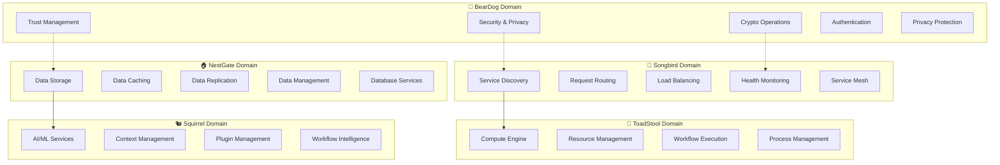

# 🏗️ Ecosystem Separation of Concerns Specification
## Clear Architectural Boundaries for BearDog, Songbird, and NestGate

---

**Status**: 📋 **ARCHITECTURAL SPEC**  
**Priority**: **FOUNDATIONAL**  
**Purpose**: Define clear responsibilities to eliminate overlap  
**Impact**: Guides all future development decisions  

---

## 🎯 **EXECUTIVE SUMMARY**

This specification establishes **clear architectural boundaries** between ecosystem components to eliminate overlap, reduce complexity, and ensure each service focuses on its core competency.

**Key Principle**: **Single Responsibility** - Each ecosystem component should have one primary domain of expertise with minimal overlap.

---

## 🌐 **ECOSYSTEM ARCHITECTURE OVERVIEW**



---

## 📋 **DOMAIN SPECIFICATIONS**

### **🐻 BEARDOG DOMAIN: Security & Privacy**

#### **✅ PRIMARY RESPONSIBILITIES**
- **🔐 Security Operations**: Cryptographic operations, key management
- **🛡️ Trust Management**: Trust relationships, verification, propagation  
- **🔑 Authentication**: BearDog-to-BearDog authentication, token management
- **🌐 Privacy Protection**: Sovereign identity, decentralized auth
- **🏛️ Access Control**: Permission management, authorization
- **📋 Compliance**: Security auditing, sovereignty validation

#### **🎯 CORE APIS**
```rust
// BearDog's focused security APIs
pub trait BearDogSecurityOperations {
    // Trust & Relationships
    async fn establish_trust(node_id: &str, trust_level: TrustLevel) -> Result<(), BearDogError>;
    async fn verify_trust(node_id: &str) -> Result<TrustLevel, BearDogError>;
    
    // Authentication & Authorization  
    async fn authenticate_node(node_id: &str, proof: AuthProof) -> Result<AuthToken, BearDogError>;
    async fn check_access(node_id: &str, resource: &str, operation: &str) -> Result<bool, BearDogError>;
    
    // Cryptographic Operations
    async fn sign_data(data: &[u8], key_id: &str) -> Result<Signature, BearDogError>;
    async fn verify_signature(data: &[u8], signature: &Signature, public_key: &[u8]) -> Result<bool, BearDogError>;
    
    // Privacy & Sovereignty
    async fn validate_sovereignty_compliance(operation: &str) -> Result<bool, BearDogError>;
    async fn audit_security_operation(operation: SecurityOperation) -> Result<AuditEntry, BearDogError>;
}
```

#### **❌ NOT BEARDOG'S RESPONSIBILITY**
- ❌ Generic service discovery → **Songbird**
- ❌ Load balancing → **Songbird**  
- ❌ Health monitoring → **Songbird**
- ❌ Data storage → **NestGate**
- ❌ Compute orchestration → **ToadStool**

---

### **🎼 SONGBIRD DOMAIN: Service Mesh & Discovery**

#### **✅ PRIMARY RESPONSIBILITIES**
- **🔍 Service Discovery**: Find services by capability, type, region
- **🌐 Request Routing**: Intelligent routing based on load, health, geography
- **⚖️ Load Balancing**: Distribute traffic across service instances
- **🏥 Health Monitoring**: Service health checks, availability tracking
- **🔗 Service Mesh**: Inter-service communication management
- **📊 Traffic Management**: Rate limiting, circuit breaking, retry logic

#### **🎯 CORE APIS**
```rust
// Songbird's service mesh APIs
pub trait SongbirdServiceMesh {
    // Service Discovery
    async fn discover_services_by_capability(capability: &str) -> Result<Vec<DiscoveredService>, SongbirdError>;
    async fn register_service(registration: ServiceRegistration) -> Result<(), SongbirdError>;
    
    // Request Routing
    async fn route_request(request: ServiceRequest) -> Result<ServiceResponse, SongbirdError>;
    async fn get_optimal_endpoint(service_name: &str, criteria: RoutingCriteria) -> Result<ServiceEndpoint, SongbirdError>;
    
    // Health & Monitoring
    async fn health_check_service(service_id: &str) -> Result<HealthStatus, SongbirdError>;
    async fn get_service_metrics(service_id: &str) -> Result<ServiceMetrics, SongbirdError>;
}
```

#### **❌ NOT SONGBIRD'S RESPONSIBILITY**
- ❌ Cryptographic operations → **BearDog**
- ❌ Trust relationships → **BearDog**
- ❌ Data persistence → **NestGate**
- ❌ Compute execution → **ToadStool**

---

### **🏠 NESTGATE DOMAIN: Data Management**

#### **✅ PRIMARY RESPONSIBILITIES**
- **💾 Data Storage**: Persistent storage, database management
- **🚀 Caching**: Distributed caching, cache invalidation
- **🔄 Data Replication**: Multi-region data replication
- **🗄️ Data Management**: Backup, recovery, archival
- **📊 Data Analytics**: Query optimization, indexing
- **🔒 Data Security**: Encryption at rest, data access control

#### **🎯 CORE APIS**
```rust
// NestGate's data management APIs  
pub trait NestGateDataOperations {
    // Storage Operations
    async fn store(key: &str, data: Vec<u8>) -> Result<(), NestGateError>;
    async fn retrieve(key: &str) -> Result<Vec<u8>, NestGateError>;
    async fn delete(key: &str) -> Result<(), NestGateError>;
    
    // Caching Operations
    async fn cache_set(key: &str, value: Vec<u8>, ttl: Duration) -> Result<(), NestGateError>;
    async fn cache_get(key: &str) -> Result<Option<Vec<u8>>, NestGateError>;
    
    // Data Management
    async fn backup_data(backup_id: &str) -> Result<BackupInfo, NestGateError>;
    async fn restore_data(backup_id: &str) -> Result<(), NestGateError>;
}
```

#### **❌ NOT NESTGATE'S RESPONSIBILITY**
- ❌ Service discovery → **Songbird**
- ❌ Cryptographic operations → **BearDog**
- ❌ Request routing → **Songbird**
- ❌ Compute orchestration → **ToadStool**

---

## 🔗 **INTEGRATION PATTERNS**

### **🔄 Cross-Domain Communication**

#### **BearDog ↔ Songbird Integration**
```rust
// BearDog uses Songbird for discovery, Songbird uses BearDog for security
impl BearDogSecurityRegistry {
    /// Use Songbird to discover other BearDog instances
    async fn discover_trusted_beardog_instances(&self) -> Result<Vec<BearDogInstance>, BearDogError> {
        // 1. Use Songbird for discovery
        let services = self.songbird_client
            .discover_services_by_capability("beardog_security")
            .await?;
        
        // 2. Apply BearDog trust filtering
        let mut trusted_instances = Vec::new();
        for service in services {
            if let Ok(instance) = BearDogInstance::from_service_info(service).await {
                if self.verify_trust(&instance.node_id).await? >= TrustLevel::Basic {
                    trusted_instances.push(instance);
                }
            }
        }
        
        Ok(trusted_instances)
    }
}
```

#### **BearDog ↔ NestGate Integration**
```rust
// BearDog uses NestGate for persistence, NestGate uses BearDog for access control
impl BearDogSecurityRegistry {
    /// Store security data with NestGate (with access control)
    async fn secure_store(&self, key: &str, data: Vec<u8>, requester: &str) -> Result<(), BearDogError> {
        // 1. Check BearDog access permissions
        self.check_access(requester, "data_storage", "write").await?;
        
        // 2. Encrypt data with BearDog crypto
        let encrypted_data = self.key_manager.encrypt(data, &self.config.storage_key).await?;
        
        // 3. Store with NestGate
        if let Some(nestgate) = &self.nestgate_client {
            nestgate.store(key, encrypted_data).await
                .map_err(|e| BearDogError::internal(format!("NestGate storage failed: {}", e)))?;
        }
        
        Ok(())
    }
}
```

---

## 🚨 **ANTI-PATTERNS TO AVOID**

### **❌ ARCHITECTURAL VIOLATIONS**

| **Anti-Pattern** | **Example** | **Correct Approach** |
|------------------|-------------|---------------------|
| **Service Discovery in BearDog** | `PhonebookService` | Use Songbird discovery APIs |
| **Data Storage in Songbird** | Direct database access | Use NestGate storage APIs |
| **Crypto Operations in NestGate** | Key generation in storage | Use BearDog crypto APIs |
| **Load Balancing in BearDog** | `FederationManager` | Use Songbird routing |
| **Health Monitoring in NestGate** | Service health checks | Use Songbird monitoring |

### **✅ CORRECT INTEGRATION PATTERNS**

| **Pattern** | **Example** | **Benefit** |
|-------------|-------------|-------------|
| **Capability-Based Discovery** | BearDog → Songbird → "beardog_security" | Clean service lookup |
| **Security-First Storage** | BearDog crypto → NestGate storage | Secure data persistence |
| **Trust-Filtered Discovery** | Songbird discovery → BearDog trust filter | Security-aware results |
| **Ecosystem Registration** | BearDog → Songbird registration | Proper service announcement |

---

## 🎯 **IMPLEMENTATION GUIDELINES**

### **🔐 BearDog Development Rules**
1. **Security First**: All operations must be cryptographically secure
2. **Trust-Based**: Filter all interactions through trust relationships
3. **Sovereignty Compliant**: Respect user privacy and autonomy
4. **Delegate Discovery**: Use Songbird for all service discovery
5. **Delegate Storage**: Use NestGate for all data persistence

### **🎼 Songbird Integration Rules**
1. **Register Capabilities**: Always register with specific capabilities
2. **Use Standard APIs**: Don't create custom discovery protocols
3. **Health Check Compliance**: Implement standard health endpoints
4. **Metadata Rich**: Provide comprehensive service metadata

### **🏠 NestGate Integration Rules**
1. **Encrypt Before Store**: Always encrypt sensitive data
2. **Access Control**: Check permissions before storage operations
3. **Backup Aware**: Design for backup/restore operations
4. **Cache Friendly**: Structure data for efficient caching

---

## 📈 **SUCCESS METRICS**

### **Architectural Clarity**
- **Zero Overlap**: No duplicate functionality between domains
- **Clear APIs**: Domain-specific interfaces only
- **Focused Codebases**: Each service <2000 lines per domain

### **Integration Quality**
- **Standard Protocols**: Use ecosystem-standard communication
- **Error Handling**: Graceful degradation on service unavailability
- **Performance**: <100ms cross-service communication

### **Maintainability**
- **Domain Expertise**: Teams can focus on their specialty
- **Independent Evolution**: Services can evolve independently
- **Clear Documentation**: Domain boundaries well-documented

---

## 🚀 **MODERNIZATION IMPACT**

### **BearDog Node Registry Transformation**

| **Aspect** | **Before** | **After** | **Benefit** |
|------------|------------|-----------|-------------|
| **Lines of Code** | ~5000 lines | ~1500 lines | 70% reduction |
| **Compilation** | 281 errors | 0 errors | 100% success |
| **Responsibility** | Generic everything | Security focus | Clear purpose |
| **Ecosystem Fit** | Overlapping | Complementary | Proper integration |
| **Maintainability** | Complex | Simple | Easy to maintain |

### **Ecosystem Benefits**
- **🎼 Songbird**: No longer competing with BearDog for discovery
- **🏠 NestGate**: Clear data management responsibility
- **🐻 BearDog**: Focused on security excellence
- **🍄 ToadStool**: Clear compute orchestration role
- **🐿️ Squirrel**: Clear AI/ML intelligence role

---

## 🎯 **FINAL RECOMMENDATION**

**IMPLEMENT SEPARATION OF CONCERNS IMMEDIATELY**

This architectural clarification will:
1. **Eliminate confusion** between service boundaries
2. **Reduce duplicate code** across ecosystem
3. **Enable focused development** within each domain
4. **Improve maintainability** through clear responsibilities
5. **Future-proof architecture** for ecosystem growth

**Next Steps**:
1. ✅ **Approve this specification**
2. 🚀 **Begin BearDog node registry modernization**  
3. 📋 **Update ecosystem documentation**
4. 🧪 **Validate integration patterns**

This separation of concerns is **foundational** for a healthy, scalable ecosystem architecture. 