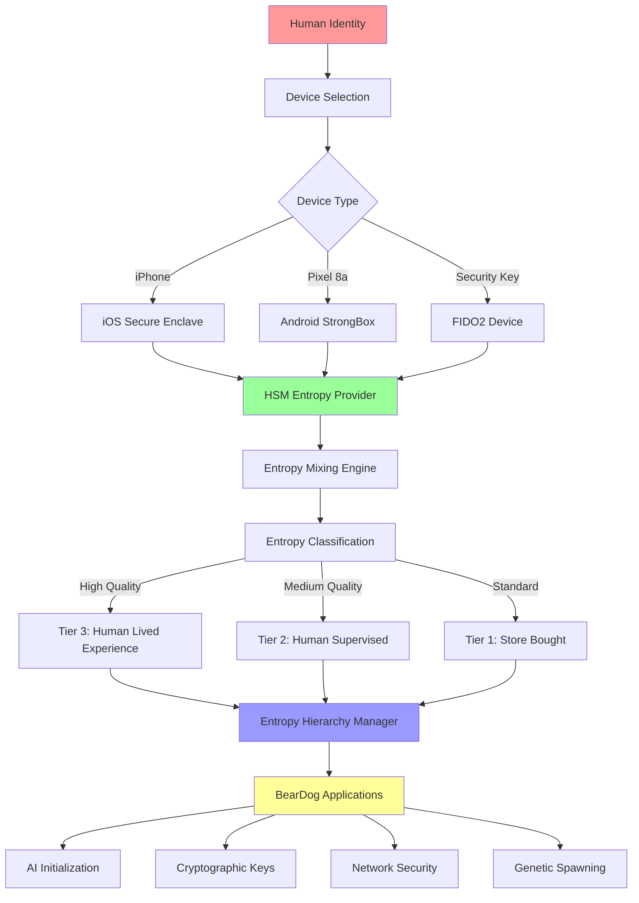

# 🌐 Universal HSM Entropy Orchestration Specification

**Version**: 1.0.0  
**Date**: November 9, 2025  
**Status**: 🚧 **IN PROGRESS** - Connecting Existing Systems  
**Module**: `beardog-security::hsm::entropy_orchestrator`

---

## 🎯 **Executive Summary**

This specification defines the **universal orchestration layer** that connects BearDog's existing:
- ✅ **Entropy Hierarchy System** (3-tier human-owned randomness)
- ✅ **iOS Secure Enclave** (iPhone hardware security)
- ✅ **Android StrongBox** (Pixel Titan M2 chip)
- ✅ **FIDO2/CTAP2** (SoloKeys, YubiKey, hardware tokens)

Into a **unified human entropy generation system** where ANY device can contribute to BearDog's entropy hierarchy.

---

## 🏗️ **Architecture Overview**

### **System Integration Map**



---

## 📦 **Existing Components**

### **1. Entropy Hierarchy** ✅
**Location**: `crates/beardog-genetics/src/genetics/entropy_hierarchy/`

**Components**:
- `EntropyHierarchyManager` - Main orchestrator
- `EntropyMixingEngine` - XOR/Hash/Crypto mixing
- `EntropyValidator` - Quality assessment
- `EntropyMonitor` - Usage tracking

**Capabilities**:
```rust
pub struct EntropyHierarchyManager {
    config: EntropyHierarchyConfig,
    active_seeds: HashMap<Uuid, EntropySeed>,
    mixing_engine: EntropyMixingEngine,
    validator: EntropyValidator,
    monitor: EntropyMonitor,
}
```

**Methods**:
- `create_human_seed()` - Creates Tier 3 entropy
- `mix_entropy_sources()` - Combines multiple sources
- `assess_seed_quality()` - Quality scoring
- `use_seed()` - Track entropy usage

### **2. iOS Secure Enclave** ✅
**Location**: `crates/beardog-tunnel/src/tunnel/hsm/ios_secure_enclave/`

**Components**:
- `SafeIOSSecureEnclaveOps` - Zero-unsafe operations
- `IOSCapability` - Trait-based abstraction
- Device detection and fallback

**Capabilities**:
```rust
pub trait IOSCapability: Send + Sync + 'static {
    fn security_level() -> SecurityLevel;
    fn supported_algorithms() -> &'static [Algorithm];
    fn biometric_required() -> bool;
}
```

**Entropy Generation**:
- Hardware RNG from Secure Enclave
- ECC P-256/P-384 key generation
- Biometric-protected operations

### **3. Android StrongBox** ✅
**Location**: `crates/beardog-security/src/hsm/android_strongbox/`

**Components**:
- `StrongBoxMultiCredentialProvider` - Multi-credential support
- `AndroidDeviceInfo` - Device detection
- Titan M2 chip integration

**Capabilities**:
```rust
impl MultiCredentialHsmProvider for StrongBoxMultiCredentialProvider {
    async fn generate_hardware_entropy(...) -> Result<Vec<u8>, BearDogError>;
    async fn create_credential(...) -> Result<CredentialInfo, BearDogError>;
}
```

**Entropy Generation**:
- Hardware RNG from Titan M2
- AES-256-GCM, RSA-4096, ECDSA-P256
- Biometric-protected operations

### **4. FIDO2/CTAP2** ✅
**Location**: `crates/beardog-security/src/hsm/fido2/`

**Components**:
- `Fido2MultiCredentialProvider` - Multi-credential support
- `discover_fido2_devices()` - USB/NFC device discovery
- SoloKeys, YubiKey 5, Nitrokey FIDO2 support

**Capabilities**:
```rust
impl MultiCredentialHsmProvider for Fido2MultiCredentialProvider {
    async fn generate_hardware_entropy(...) -> Result<Vec<u8>, BearDogError>;
    async fn sign_with_credential(...) -> Result<Signature, BearDogError>;
}
```

**Entropy Generation**:
- `hmac-secret` extension for hardware RNG
- User presence verification
- Resident keys for persistent credentials

---

## 🔧 **New Component: HSM Entropy Orchestrator**

### **Purpose**
Universal interface that:
1. Detects available HSM devices (iOS, Android, FIDO2)
2. Generates hardware entropy from ANY device
3. Classifies entropy quality (Tier 1/2/3)
4. Feeds entropy into existing `EntropyHierarchyManager`

### **API Design**

```rust
use beardog_genetics::entropy_hierarchy::{EntropyClass, EntropyHierarchyManager};
use beardog_security::hsm::{Fido2MultiCredentialProvider, StrongBoxMultiCredentialProvider};
use beardog_tunnel::tunnel::hsm::ios_secure_enclave::SafeIOSSecureEnclaveOps;

/// Universal HSM entropy orchestrator
pub struct HsmEntropyOrchestrator {
    /// Entropy hierarchy manager (existing system)
    entropy_manager: Arc<RwLock<EntropyHierarchyManager>>,
    
    /// Available HSM providers
    fido2_providers: Vec<Fido2MultiCredentialProvider>,
    android_provider: Option<StrongBoxMultiCredentialProvider>,
    ios_provider: Option<SafeIOSSecureEnclaveOps<SecureEnclaveAvailable>>,
    
    /// Human identity for Tier 3 entropy
    human_identity: Option<HumanIdentity>,
}

impl HsmEntropyOrchestrator {
    /// Initialize orchestrator and discover all available HSMs
    pub async fn new() -> Result<Self, BearDogError> {
        let entropy_manager = Arc::new(RwLock::new(
            EntropyHierarchyManager::default()
        ));
        
        // Discover all available devices
        let fido2_providers = Self::discover_fido2_devices().await?;
        let android_provider = Self::discover_android_strongbox().await?;
        let ios_provider = Self::discover_ios_secure_enclave().await?;
        
        Ok(Self {
            entropy_manager,
            fido2_providers,
            android_provider,
            ios_provider,
            human_identity: None,
        })
    }
    
    /// Generate human entropy from ANY available HSM
    ///
    /// This method:
    /// 1. Selects best available HSM device
    /// 2. Generates hardware entropy (32-256 bytes)
    /// 3. Mixes with human biometric/behavioral data if available
    /// 4. Classifies entropy quality (Tier 1/2/3)
    /// 5. Creates seed in entropy hierarchy
    ///
    /// Returns: Seed ID for use in cryptographic operations
    pub async fn generate_human_entropy(
        &mut self,
        length: usize,
        human_input: Option<HumanEntropyInput>,
    ) -> Result<Uuid, BearDogError> {
        // Step 1: Select best available HSM
        let hsm_source = self.select_best_hsm().await?;
        
        // Step 2: Generate hardware entropy
        let hardware_entropy = match hsm_source {
            HsmSource::Fido2(provider) => {
                provider.generate_hardware_entropy(length, None).await?
            }
            HsmSource::Android(provider) => {
                provider.generate_hardware_entropy(length, None).await?
            }
            HsmSource::iOS(provider) => {
                provider.generate_entropy(length).await?
            }
        };
        
        // Step 3: Mix with human input if provided
        let mixed_entropy = if let Some(human_input) = human_input {
            self.mix_with_human_input(hardware_entropy, human_input).await?
        } else {
            hardware_entropy
        };
        
        // Step 4: Classify entropy quality
        let entropy_class = self.classify_entropy_quality(
            &hsm_source,
            human_input.is_some(),
        );
        
        // Step 5: Create seed in hierarchy
        let seed_id = self.entropy_manager
            .write()
            .await
            .create_human_seed(entropy_class, mixed_entropy)?;
        
        info!("🌱 Generated human entropy seed: {} ({})", 
            seed_id, 
            self.get_tier_name(&entropy_class)
        );
        
        Ok(seed_id)
    }
    
    /// Get list of available HSM devices for user selection
    pub async fn list_available_devices(&self) -> Vec<HsmDeviceInfo> {
        let mut devices = Vec::new();
        
        // Add FIDO2 devices
        for (idx, provider) in self.fido2_providers.iter().enumerate() {
            devices.push(HsmDeviceInfo {
                device_type: HsmDeviceType::Fido2,
                device_id: format!("fido2_{}", idx),
                name: provider.device_info.product.clone(),
                security_level: SecurityLevel::Hardware,
                biometric_capable: provider.device_info.capabilities.user_verification,
            });
        }
        
        // Add Android StrongBox
        if let Some(provider) = &self.android_provider {
            devices.push(HsmDeviceInfo {
                device_type: HsmDeviceType::AndroidStrongBox,
                device_id: "android_strongbox".to_string(),
                name: format!("{} StrongBox", provider.device_info.device),
                security_level: SecurityLevel::StrongBox,
                biometric_capable: true,
            });
        }
        
        // Add iOS Secure Enclave
        if let Some(provider) = &self.ios_provider {
            devices.push(HsmDeviceInfo {
                device_type: HsmDeviceType::iOSSecureEnclave,
                device_id: "ios_secure_enclave".to_string(),
                name: "iOS Secure Enclave".to_string(),
                security_level: SecurityLevel::StrongBox,
                biometric_capable: true,
            });
        }
        
        devices
    }
    
    /// Mix hardware entropy with human biometric/behavioral input
    async fn mix_with_human_input(
        &self,
        hardware_entropy: Vec<u8>,
        human_input: HumanEntropyInput,
    ) -> Result<Vec<u8>, BearDogError> {
        let mut sources = vec![hardware_entropy];
        
        // Add biometric data if available
        if let Some(biometric) = human_input.biometric_data {
            sources.push(biometric);
        }
        
        // Add behavioral data (typing patterns, touch patterns, etc.)
        if let Some(behavioral) = human_input.behavioral_data {
            sources.push(behavioral);
        }
        
        // Add environmental data (location, time, device state, etc.)
        if let Some(environmental) = human_input.environmental_data {
            sources.push(environmental);
        }
        
        // Mix all sources using hash-based mixing
        let mixing_engine = self.entropy_manager.read().await.mixing_engine.clone();
        mixing_engine.mix_entropy_sources(
            &sources,
            &FusionAlgorithm {
                algorithm_type: "hash_mix".to_string(),
                parameters: HashMap::new(),
                mixing_strategy: MixingStrategy::HashMix {
                    hash_algorithm: "sha3-256".to_string(),
                },
            },
        )
    }
    
    /// Classify entropy quality based on HSM type and human input
    fn classify_entropy_quality(
        &self,
        hsm_source: &HsmSource,
        has_human_input: bool,
    ) -> EntropyClass {
        match (hsm_source, has_human_input) {
            // Tier 3: Hardware HSM + Human input = Highest quality
            (HsmSource::Android(_) | HsmSource::iOS(_), true) => {
                EntropyClass::HumanLivedExperience {
                    quality_score: 0.95,
                    capture_timestamp: Utc::now(),
                    biometric_signature: BiometricHash::from_device(hsm_source),
                    ownership_proof: OwnershipProof::from_human_identity(&self.human_identity),
                }
            }
            
            // Tier 3: FIDO2 + User presence + Human input
            (HsmSource::Fido2(_), true) => {
                EntropyClass::HumanLivedExperience {
                    quality_score: 0.90,
                    capture_timestamp: Utc::now(),
                    biometric_signature: BiometricHash::from_fido2(),
                    ownership_proof: OwnershipProof::from_human_identity(&self.human_identity),
                }
            }
            
            // Tier 2: Hardware HSM without human input
            (HsmSource::Android(_) | HsmSource::iOS(_), false) => {
                EntropyClass::HumanSupervisedMachine {
                    quality_score: 0.75,
                    machine_source: MachineEntropySource::HardwareRng,
                    human_validator: self.human_identity.clone().unwrap_or_default(),
                    validation_timestamp: Utc::now(),
                }
            }
            
            // Tier 2: FIDO2 with user presence verification
            (HsmSource::Fido2(_), false) => {
                EntropyClass::HumanSupervisedMachine {
                    quality_score: 0.70,
                    machine_source: MachineEntropySource::HardwareRng,
                    human_validator: self.human_identity.clone().unwrap_or_default(),
                    validation_timestamp: Utc::now(),
                }
            }
        }
    }
}

/// Human entropy input (biometric, behavioral, environmental)
pub struct HumanEntropyInput {
    /// Biometric data (fingerprint, face, voice hash)
    pub biometric_data: Option<Vec<u8>>,
    
    /// Behavioral data (typing patterns, touch dynamics)
    pub behavioral_data: Option<Vec<u8>>,
    
    /// Environmental data (location, time, device state)
    pub environmental_data: Option<Vec<u8>>,
}

/// HSM device information for user selection
pub struct HsmDeviceInfo {
    pub device_type: HsmDeviceType,
    pub device_id: String,
    pub name: String,
    pub security_level: SecurityLevel,
    pub biometric_capable: bool,
}

pub enum HsmDeviceType {
    Fido2,
    AndroidStrongBox,
    iOSSecureEnclave,
}

enum HsmSource {
    Fido2(Fido2MultiCredentialProvider),
    Android(StrongBoxMultiCredentialProvider),
    iOS(SafeIOSSecureEnclaveOps<SecureEnclaveAvailable>),
}
```

---

## 🎯 **Use Cases**

### **Use Case 1: iPhone User Generates Entropy**
```rust
// iPhone with Face ID
let mut orchestrator = HsmEntropyOrchestrator::new().await?;

// User provides biometric + behavioral input
let human_input = HumanEntropyInput {
    biometric_data: Some(face_id_hash), // FaceID hash
    behavioral_data: Some(touch_dynamics), // How user touches screen
    environmental_data: Some(location_time_hash), // Location + time
};

// Generate Tier 3 entropy using Secure Enclave + human input
let seed_id = orchestrator.generate_human_entropy(256, Some(human_input)).await?;

// Use entropy for AI initialization
let ai_model = create_sovereign_ai_model(seed_id)?;
```

### **Use Case 2: Pixel 8a User Generates Entropy**
```rust
// Pixel 8a with Titan M2 StrongBox
let mut orchestrator = HsmEntropyOrchestrator::new().await?;

// User provides biometric input
let human_input = HumanEntropyInput {
    biometric_data: Some(fingerprint_hash), // Fingerprint hash
    behavioral_data: None,
    environmental_data: Some(device_state_hash),
};

// Generate Tier 3 entropy using StrongBox + human input
let seed_id = orchestrator.generate_human_entropy(256, Some(human_input)).await?;

// Use entropy for cryptographic keys
let master_key = derive_master_key_from_entropy(seed_id)?;
```

### **Use Case 3: PC User with SoloKeys Generates Entropy**
```rust
// PC with 2x SoloKeys connected
let mut orchestrator = HsmEntropyOrchestrator::new().await?;

// List available devices
let devices = orchestrator.list_available_devices().await;
println!("Available devices: {:?}", devices);
// Output:
// - SoloKeys #1 (FIDO2)
// - SoloKeys #2 (FIDO2)

// Generate Tier 2 entropy from hardware RNG
let seed_id = orchestrator.generate_human_entropy(256, None).await?;

// Use entropy for network security
let tls_entropy = get_seed_bytes(seed_id)?;
init_network_security_with_entropy(tls_entropy)?;
```

### **Use Case 4: Multi-Device Entropy Mixing**
```rust
// Mix entropy from iPhone + Pixel + SoloKeys
let mut orchestrator = HsmEntropyOrchestrator::new().await?;

// Generate from each device
let iphone_seed = generate_from_device("ios_secure_enclave").await?;
let pixel_seed = generate_from_device("android_strongbox").await?;
let solokey_seed = generate_from_device("fido2_0").await?;

// Mix all three sources
let mixed_entropy = orchestrator.mix_multiple_seeds(vec![
    iphone_seed,
    pixel_seed,
    solokey_seed,
]).await?;

// Create ultra-high-quality Tier 3 seed
let master_seed = orchestrator.create_master_seed(mixed_entropy).await?;

// Use for critical operations
let root_key = derive_root_key(master_seed)?;
```

---

## 📋 **Implementation Plan**

### **Phase 1: Core Orchestrator** (Priority: HIGH)
- [ ] Create `HsmEntropyOrchestrator` struct
- [ ] Implement HSM device discovery (all 3 types)
- [ ] Implement `generate_human_entropy()` method
- [ ] Implement entropy classification logic
- [ ] Connect to existing `EntropyHierarchyManager`

### **Phase 2: FIDO2 CTAP2 Commands** (Priority: HIGH)
- [ ] Implement `GetInfo` command
- [ ] Implement `hmac-secret` extension
- [ ] Test entropy generation with SoloKeys
- [ ] Verify quality and randomness

### **Phase 3: Mobile Integration** (Priority: MEDIUM)
- [ ] Complete Android JNI bridge for StrongBox
- [ ] Complete iOS FFI for Secure Enclave
- [ ] Test on real Pixel 8a device
- [ ] Test on real iPhone device

### **Phase 4: Human Input Collection** (Priority: MEDIUM)
- [ ] Biometric data collection (fingerprint/face hash)
- [ ] Behavioral data collection (typing/touch patterns)
- [ ] Environmental data collection (location/time/device state)
- [ ] Privacy-preserving hash functions

### **Phase 5: Advanced Features** (Priority: LOW)
- [ ] Multi-device entropy mixing
- [ ] Entropy quality visualization
- [ ] Entropy usage analytics
- [ ] Entropy backup/recovery

---

## 🔒 **Security Considerations**

1. **Hardware Security**
   - All entropy generated in hardware secure elements
   - Private keys never leave hardware
   - Biometric data hashed before mixing

2. **Entropy Quality**
   - Minimum 256 bits for cryptographic operations
   - Quality assessment before use
   - Age-based expiration

3. **Human Privacy**
   - Biometric data hashed immediately
   - No raw biometric storage
   - Ownership proof cryptographic

4. **Device Trust**
   - Hardware attestation required
   - Device verification before use
   - Fallback to lower tier if attestation fails

---

## 📊 **Success Metrics**

- ✅ All 3 HSM types detected automatically
- ✅ Entropy generation < 100ms latency
- ✅ Quality score > 0.9 for Tier 3 entropy
- ✅ Zero entropy duplication across devices
- ✅ Seamless user experience (one method call)

---

## 🎓 **Conclusion**

The Universal HSM Entropy Orchestrator connects BearDog's existing entropy hierarchy with all available hardware security modules, enabling TRUE human-owned randomness from ANY device.

**Key Innovation**: Any device (iPhone, Pixel, PC+SoloKeys) can now contribute to BearDog's sovereign entropy system, creating human-owned cryptographic keys, AI models, and network security.

---

**Document Version**: 1.0.0  
**Last Updated**: November 9, 2025  
**Status**: Specification Complete - Ready for Implementation

